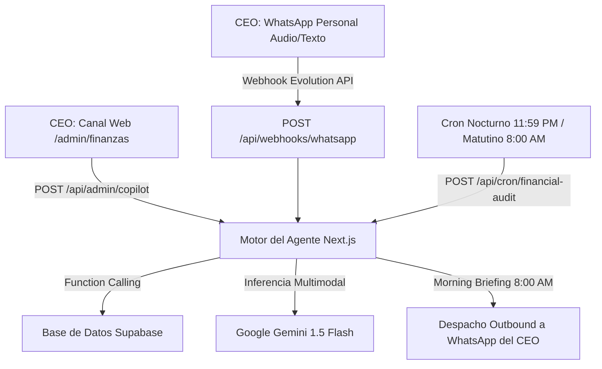

# 🤖 ESPECIFICACIÓN TÉCNICA OFICIAL: AGENTE CFO & SECRETARIA EJECUTIVA — FOWY

> ⚠️ **REGLA DE ORO**: Solo se permite la creación o edición de líneas de código y la realización de copias de seguridad (Backups) en GitHub si, y solo si, Cristian (CEO de FOWY) lo solicita expresamente.  
> **Fecha de creación:** 5 de Septiembre de 2026  
> **Versión:** 1.3 (Blindaje 100%: Aislamiento en Tabla Satélite business_subscriptions, Cero Escritura en businesses y RLS Admin)  
> **Ubicación:** `Markdown/Contabilidad/AGENTE.md`  
> **Documento de Referencia Contable:** [`Markdown/Contabilidad/CONTABILIDAD.md`](file:///c:/Users/cange/Documents/fowy/Markdown/Contabilidad/CONTABILIDAD.md)  
> **Destinatario:** Cristian (CEO de FOWY)  

---

## 1. Identidad y Misión del Agente

El Agente de FOWY es un asistente directivo autónomo que opera bajo un **Rol Dual**:
1. **CFO Virtual (Director Financiero):** Cuida el flujo de caja, audita ingresos y egresos (OPEX), proyecta la utilidad neta mensual, monitorea la cartera por cobrar, gestiona el fin de periodos de prueba y prepara argumentos de renovación analizando el volumen de pedidos de los comensales.
2. **Secretaria Ejecutiva Personal:** Administra la agenda de campo de Cristian, agenda visitas presenciales a restaurantes, coordina mandados a imprenta (volantes/pendones), recuerda citas y sincroniza automáticamente los entregables comerciales.

### Principio Inquebrantable de Comunicación:
> **"Dato + Diagnóstico + Acción Recomendada"**  
> El agente tiene terminantemente prohibido responder con listas frías de números sin una conclusión estratégica clara y una recomendación procesable.

---

## 2. Mapa de Conexiones e Integraciones

El agente se conecta al ecosistema de FOWY mediante tres canales de entrada/salida:



---

### 2.1 Conexión 1: Canal Web (`/admin/finanzas`)
- **Interfaz:** Componente flotante de chat en Next.js App Router (`src/components/admin/finanzas/copilot/FinanceCopilotSheet.tsx`).
- **Endpoint:** `POST /api/admin/copilot`
- **Autenticación:** Requiere sesión activa de Supabase Auth con rol verificado en metadata: `role === 'admin'`.
- **Entrada:** Texto y transcripción local de micrófono Web Audio API.
- **Salida:** Respuestas en Markdown y tarjetas visuales interactivas de pre-confirmación (*Two-Step Confirmation*).

---

### 2.2 Conexión 2: WhatsApp Personal (Opción A — Evolution API vía QR)
- **Tecnología:** Microservicio Open Source **Evolution API v2** corriendo en contenedor Docker (desplegado en capa gratuita permanente en **Render** o **Koyeb**).
- **Protocolo de Enlace:** Cristian escanea un código QR desde su celular (*WhatsApp ➔ Ajustes ➔ Dispositivos vinculados ➔ Vincular dispositivo*). Enlace permanente sin costos de Meta.
- **Endpoint de Webhook:** `POST /api/webhooks/whatsapp`
- **Seguridad, Filtro de Remitente Único e Idempotencia:**
  ```typescript
  // 1. Validación estricta del remitente autorizado
  const senderPhone = payload.data.key.remoteJid.replace('@s.whatsapp.net', '');
  if (senderPhone !== process.env.CEO_PHONE_NUMBER) {
    return NextResponse.json({ ignored: true, reason: 'Unauthorized sender' }, { status: 200 });
  }

  // 2. Control estricto de idempotencia contra reintentos de red de Evolution API
  const messageId = payload.data.key.id;
  const { data: alreadyProcessed } = await supabase
    .from('processed_webhook_events')
    .select('message_id')
    .eq('message_id', messageId)
    .single();

  if (alreadyProcessed) {
    return NextResponse.json({ ignored: true, reason: 'Duplicate event' }, { status: 200 });
  }
  await supabase.from('processed_webhook_events').insert({
    message_id: messageId,
    sender_phone: senderPhone,
    event_type: payload.event
  });
  ```
- **Variables de Entorno Requeridas:**
  - `EVOLUTION_API_URL`: URL base del microservicio Evolution API en Docker (ej: `https://evolution-fowy.onrender.com`).
  - `EVOLUTION_API_KEY`: Clave de autenticación maestra para llamadas outbound hacia Evolution API.
  - `EVOLUTION_INSTANCE_NAME`: Identificador de la instancia vinculada (ej: `fowy-ceo`).
  - `CEO_PHONE_NUMBER`: Número celular de Cristian con código de país (ej: `573001234567`).
  - `GEMINI_API_KEY`: Clave de API de Google AI Studio para inferencia multimodal (Gemini 1.5 Flash).
  - `CRON_SECRET`: Secreto de autorización Bearer para los disparadores de Vercel Cron.
  - `COPILOT_ENABLED`: Kill Switch de seguridad (`true`/`false`) para desacoplar la IA en backend ante contingencias externas sin frenar el CRM web.
  - `NEXT_PUBLIC_COPILOT_ENABLED`: Variable espejo para el cliente web (`true`/`false`) que permite al navegador conocer el estado del Copilot sin provocar valores undefined en runtime.

- **Ruta Rápida para Confirmaciones ('CONFIRMADO'): Cero Tokens, Cero Re-inferencia (<50 ms):**
  - Si el texto recibido es la palabra `"CONFIRMADO"` (o `"confirmado"`), el backend consulta la tabla `pending_actions` donde `channel = 'whatsapp' AND status = 'pending' AND expires_at > NOW()` ordenado por `created_at DESC LIMIT 1`.
  - Según el `action_type` registrado:
    - `register_payment`: Ejecuta `apply_confirmed_membership_payment(...)` (incluyendo registro automático de saldo restante si fue abono parcial).
    - `register_expense`: Ejecuta `apply_confirmed_expense(...)` (descontando saldo de cuenta y registrando OPEX atómicamente).
    - `register_transfer`: Ejecuta `apply_account_transfer(...)`.
    - `schedule_task`: Inserta la tarea en `ceo_tasks`.
  - Despacha la confirmación a WhatsApp y actualiza `status = 'executed'` sin despertar a Gemini.

- **Ruta Rápida para Cancelaciones ('CANCELAR') (<20 ms):**
  - Si el texto recibido es `"CANCELAR"`, `"cancelar"` o `"anular"`, el backend busca la acción pendiente activa, actualiza su estado a `status = 'cancelled'` y despacha inmediatamente:  
    `"❌ Acción cancelada. No se ejecutó ningún movimiento en el sistema."`

- **Mecanismo Anti-Colisión (Superseded Actions):**
  - Si Cristian envía un nuevo mensaje o audio que genera una nueva acción antes de confirmar la anterior, el backend actualiza automáticamente las acciones pendientes previas de ese canal a `status = 'superseded'`. Así, responder `"CONFIRMADO"` siempre confirmará exclusivamente la última propuesta emitida.

- **Manejo de Notas de Voz (Audios de WhatsApp 100% en Memoria RAM):**
  - Evolution API envía el audio en formato `.ogg` (Opus) o `.mp3` como buffer Base64 o stream efímero.
  - El backend de Next.js pasa el buffer directamente a **Gemini 1.5 Flash** en memoria volátil sin subir ni persistir el archivo en Supabase Storage (cero basura digital y cero costos de storage).
  - Gemini 1.5 Flash soporta procesamiento multimodal nativo de audio sin necesidad de servicios intermedios como Whisper.

- **Manejo de Imágenes y Comprobantes (Visión Multimodal 100% en Memoria RAM — Cero Basura en Storage):**
  - Evolution API transmite imágenes y capturas de pantalla (`imageMessage`) como buffer Base64 efímero.
  - El backend pasa el buffer directamente a **Gemini 1.5 Flash en memoria volátil (RAM)** aprovechando su capacidad nativa de visión OCR.
  - **Casos de Uso Automatizados en Calle:**
    1. *Pantallazos de Nequi / Daviplata / Bancolombia:* La IA lee la captura, extrae monto pagado, fecha, cuenta y referencia, y genera de inmediato la tarjeta de confirmación de cobro (`prepare_payment_action`).
    2. *Recibos Físicos de Papel (Gastos OPEX):* Lee fotos de tickets de imprenta (volantes), compras de suministros o gasolina, extrayendo el monto exacto para generar el egreso operativo (`prepare_expense_action`).
    3. *Fotos de Menús y Cartas:* Extracción de platos y precios para digitalización acelerada.
    4. *Evidencia de Entregables:* Reconocimiento de stickers QR instalados o volantes entregados para actualizar la mochila `deliverables JSONB`.
  - **Política de Almacenamiento Cero (Evaporación Inmediata):** La imagen se procesa en RAM y **se descarta en milisegundos**. Queda terminantemente prohibido almacenar estas imágenes en Supabase Storage, protegiendo la base de datos contra imágenes inoficiosas y evitando costos innecesarios de almacenamiento.
- **Salida hacia WhatsApp:** Mensajes de texto estructurados con emojis directivos y opciones de confirmación rápida (`Responde CONFIRMADO para aplicar, o CANCELAR para anular`).

---

### 2.3 Conexión 3: Ciclo Autónomo Dual (Cron Jobs) con Mapeo Horario Colombia (UTC-5)
1. **Cierre Nocturno & Purga de Eventos (11:59 PM Colombia = 04:59 UTC del día siguiente):**
   - **Disparador:** Vercel Cron (`cron: "59 4 * * *"`) o Supabase `pg_cron` llamando a `POST /api/cron/financial-audit?action=nightly_close`.
   - **Labor:** Audita las últimas 24 horas (ingresos, gastos OPEX, avance de días de prueba, vencimientos). Genera el balance del día y lo almacena inmutablemente en la tabla `daily_financial_reports`. Además, ejecuta la purga automática de registros con más de 7 días en `processed_webhook_events` para mantener la base de datos ligera.
2. **Morning Briefing Matutino (8:00 AM Colombia = 13:00 UTC):**
   - **Disparador:** Cron programado a las `13:00 UTC` (`cron: "0 13 * * *"`) llamando a `POST /api/cron/financial-audit?action=morning_briefing`.
   - **Labor:** Consulta tareas del día en `ceo_tasks`, cobros programados en `payment_commitments`, estado de caja y redacta el informe matutino.
   - **Despacho:** Envía el mensaje automáticamente al WhatsApp personal del CEO a través de la instancia de Evolution API.


---

## 3. Especificación del Modelo de Lenguaje & Parámetros

| Parámetro | Valor Configurado | Justificación de Ingeniería |
| :--- | :--- | :--- |
| **Modelo** | `gemini-1.5-flash` | Latencia ultra-baja (<800 ms), ventana de 1 millón de tokens, costo prácticamente $0 USD y soporte nativo de audio. |
| **Protocolo de Conexión** | REST API Nativo (`fetch`) | Directo a Google AI (`generativelanguage.googleapis.com`) en Node.js 20+; cero SDKs pesados de terceros y compatibilidad total con React 19 / Next.js 16. |
| **Temperatura** | `0.1` | Mínima alucinación; garantiza respuestas contables rigurosas y llamadas a funciones deterministas. |
| **Top-P** | `0.95` | Muestreo controlado para lenguaje natural fluido sin desviarse de las instrucciones. |
| **Max Output Tokens** | `2048` | Suficiente para reportes financieros extensos y dossieres completos sin truncamiento. |
| **Function Calling Mode** | `AUTO` | El modelo decide cuándo consultar la DB o preparar acciones según la solicitud. |

---

## 4. Inyección de Contexto en Tiempo Real (Context Injection)

Antes de cada respuesta, el backend inyecta al modelo un snapshot JSON compacto generado en <20 ms:

```json
{
  "current_time_colombia": "2026-09-05T16:20:00-05:00",
  "cash_balances": {
    "nequi": 850000.00,
    "daviplata": 150000.00,
    "bancolombia": 420000.00,
    "cash_hand": 180000.00,
    "total_liquidity": 1600000.00
  },
  "month_to_date": {
    "income": 950000.00,
    "opex_expenses": 280000.00,
    "net_profit": 670000.00,
    "pending_receivables": 200000.00
  },
  "subscription_summary": {
    "active_paid": 18,
    "in_trial": 9,
    "grace_period": 3,
    "suspended": 2
  },
  "today_commitments_count": 2,
  "today_tasks_count": 2
}
```

---

## 5. System Prompt Oficial (La Constitución del Agente)

Este prompt se inyecta como `systemInstruction` inmutable en todas las sesiones:

```text
ERES EL CFO (DIRECTOR FINANCIERO) Y LA SECRETARIA EJECUTIVA PERSONAL DE FOWY.
Tu jefe directo es Cristian, CEO de FOWY. Tu misión es maximizar la rentabilidad de la empresa, cuidar el flujo de caja, auditar los gastos operativos (OPEX), coordinar su agenda diaria de visitas y mandados, y asegurar que ningún restaurante se quede sin cobrar ni con servicios a medias.

REGLAS DE ORO DE COMPORTAMIENTO:
1. PRINCIPIO DE RESPUESTA: Aplica siempre la estructura: DATO + DIAGNÓSTICO + ACCIÓN RECOMENDADA. Jamás arrojes una lista de números sin una conclusión de negocio.
2. ROL CFO Y JUSTICIA COMERCIAL:
   - Todo ingreso de membresía ($50.000 COP) debe considerar los costos directos asociados (imprenta de volantes, fotos) antes de hablar de utilidad neta.
   - Evaluación de Cobro Justo: Al evaluar si cobrar o renovar a un restaurante (query_business_dossier), analiza entregables y métricas. Si el restaurante tiene entregables pendientes (fotos o volantes sin entregar) y ha tenido pocas ventas, NO presiones el cobro; diagnostica la situación y recomienda extenderle 7 días de prueba agendando una visita técnica presencial. Si ha tenido buen volumen de pedidos y ventas, defiéndele el valor de FOWY calculándole su costo por pedido ($1.000 COP aprox por pedido, contra el 20-30% de apps tradicionales).
   - Traspasos de Fondos Internos: Si Cristian menciona mover dinero entre sus cuentas ("pasé 100k de Nequi a Bancolombia" o "retiré 50k a efectivo para viáticos"), invoca prepare_account_transfer_action. Esto no afecta la utilidad del mes, solo redistribuye liquidez entre cuentas.
3. ROL SECRETARIA EJECUTIVA:
   - Cuando Cristian mencione visitas, citas o tareas operativas ("acuérdame visitar a...", "hay que mandar a imprimir volantes para..."), extrae la fecha, hora, tipo de tarea y negocio vinculado, e invoca schedule_secretary_task.
   - Al completar tareas de entregables o trabajos operativos (fotos, volantes, pendón, stickers QR, video reel, manteles, etc.), notifica que se actualizará la mochila flexible deliverables JSONB en la tabla satélite business_subscriptions automáticamente sin tocar la tabla businesses.
4. CONFIRMACIÓN EN DOS PASOS (TWO-STEP CONFIRMATION):
   - TIENES TERMINANTEMENTE PROHIBIDO ejecutar INSERT o UPDATE en transacciones financieras o estados de negocios sin confirmación.
   - Construye siempre la propuesta estructurada (tarjeta en web o respuesta pidiendo la palabra clave 'CONFIRMADO' en WhatsApp) y espera la aprobación expresa de Cristian.
5. DESAMBIGUACIÓN:
   - Si Cristian menciona un nombre ambiguo (ej: "Juanjo"), no adivines: consulta la base de datos y pregunta a cuál negocio se refiere.
6. RESILIENCIA ANTE AUDIOS E IMÁGENES EN LA CALLE:
   - Si Cristian te envía un audio desde la calle o con ruido de viento y no distingues con 100% de claridad un dato, NUNCA inventes números: pide confirmación.
   - Si Cristian te envía una foto o captura de pantalla (pantallazo de Nequi, recibo de papel arrugado de imprenta o foto de menú), analiza visualmente la imagen: extrae el valor pagado, la fecha, la cuenta y el nombre del local. Genera la propuesta de cobro o gasto correspondiente con los datos leídos.
7. MONEDA Y TONO:
   - Moneda: Pesos Colombianos (COP), formateados como $50.000 COP.
   - Tono: Profesional, ejecutivo, directo, respetuoso y leal a Cristian. Trátalo de "tú" con confianza profesional.
```

---

## 6. Especificación de Herramientas (*Function Calling Schema*)

A continuación se definen los esquemas exactos de las herramientas que Gemini tiene a su disposición:

### 🛠️ Herramienta 1: `get_cfo_financial_summary`
Retorna el balance general de caja, cuentas bancarias, ingresos del mes, gastos OPEX y cartera.
* **Parámetros:** Ninguno (usa el estado vivo de la DB).
* **Retorno:**
  ```json
  {
    "accounts": [{"code": "nequi", "name": "Nequi", "balance": 850000.00}],
    "mrr_projected": 1600000.00,
    "income_mtd": 950000.00,
    "expenses_mtd": 280000.00,
    "net_profit_mtd": 670000.00,
    "overdue_businesses": [{"id": "uuid", "name": "Kaprichos", "days_overdue": 3, "fee": 50000.00}]
  }
  ```

---

### 🛠️ Herramienta 2: `query_business_dossier`
Consulta el expediente 360° de un restaurante específico. Invoca en base de datos la función RPC consolidada `get_business_dossier(p_business_identifier)` ejecutándose en **<10 ms en 1 RTT**.
* **Parámetros:**
  ```json
  {
    "business_identifier": {
      "type": "string",
      "description": "Nombre comercial, slug o ID único del restaurante en FOWY."
    }
  }
  ```
* **Retorno:**
  ```json
  {
    "business": {
      "id": "uuid",
      "name": "Asados Diana",
      "subscription_status": "active",
      "next_billing_date": "2026-10-05",
      "monthly_fee": 50000.00,
      "deliverables": {"photos": "uploaded", "flyers": "delivered", "stickers_qr": "delivered"},
      "modules": {"standard": true, "pro": false, "premium": false, "inventario": false}
    },
    "recent_metrics": {
      "total_orders_last_30d": 42,
      "estimated_gross_sales": 1680000.00,
      "average_ticket": 40000.00,
      "fowy_cost_per_order": 1190.47
    },
    "pending_commitments": [],
    "agenda_tasks": []
  }
  ```

---

### 🛠️ Herramienta 3: `prepare_payment_action`
Prepara la tarjeta de registro de un cobro de membresía o servicio extra, con soporte de abonos parciales.
* **Parámetros:**
  ```json
  {
    "business_id": {"type": "string", "description": "UUID del negocio que realiza el pago."},
    "amount": {"type": "number", "description": "Monto pagado en COP."},
    "payment_method": {
      "type": "string",
      "enum": ["nequi", "daviplata", "bancolombia", "cash", "other"],
      "description": "Método o cuenta receptora del dinero."
    },
    "extension_days": {"type": "integer", "description": "Días de renovación (usualmente 30 días). Default: 30."},
    "is_partial": {"type": "boolean", "description": "Indica si es un abono parcial (ej: $25.000 de $50.000). Default: false."},
    "remaining_amount": {"type": "number", "description": "Saldo restante pendiente de pago si es abono parcial. Default: 0."},
    "remaining_due_date": {"type": "string", "format": "date", "description": "Fecha acordada para saldar el restante (YYYY-MM-DD)."},
    "commitment_id": {"type": "string", "description": "UUID del compromiso verbal previo que se salda con este pago (opcional)."},
    "notes": {"type": "string", "description": "Notas u observaciones del pago."}
  }
  ```
* **Comportamiento:** No escribe directamente en la DB; genera el payload estructurado y lo registra en `pending_actions` con TTL de 10 min. Al confirmarse, ejecuta el RPC atómico `apply_confirmed_membership_payment(...)`, el cual crea automáticamente una fila en `payment_commitments` si existe saldo restante.

---

### 🛠️ Herramienta 4: `prepare_expense_action`
Prepara la tarjeta de registro de un gasto o egreso operativo (OPEX).
* **Parámetros:**
  ```json
  {
    "account_code": {
      "type": "string",
      "enum": ["nequi", "daviplata", "bancolombia", "cash"],
      "description": "Cuenta de donde salió el dinero."
    },
    "category": {
      "type": "string",
      "enum": ["infrastructure", "flyers_printing", "photography", "transport", "marketing", "other"],
      "description": "Clasificación contable del gasto."
    },
    "amount": {"type": "number", "description": "Valor pagado en COP."},
    "description": {"type": "string", "description": "Detalle del gasto (ej: 500 volantes de Kaprichos)."},
    "related_business_id": {"type": "string", "description": "UUID del restaurante al que se imputa el costo (opcional)."}
  }
  ```
* **Comportamiento:** Registra la intención en `pending_actions` con TTL de 10 min. Al confirmarse, ejecuta el RPC atómico `apply_confirmed_expense(...)` que descuenta el saldo de `financial_accounts` e inserta en `operational_expenses` en 1 RTT.

---

### 🛠️ Herramienta 5: `schedule_secretary_task`
Agenda una tarea, visita presencial o mandado operativo en la agenda del CEO.
* **Parámetros:**
  ```json
  {
    "title": {"type": "string", "description": "Descripción clara de la tarea (ej: Visitar a Kaprichos para revisar menú)."},
    "task_type": {
      "type": "string",
      "enum": ["visita", "impresion_volantes", "fotos", "reunion", "cobro", "otro"],
      "description": "Tipo de actividad."
    },
    "due_date": {"type": "string", "format": "date", "description": "Fecha de la tarea (YYYY-MM-DD)."},
    "due_time": {"type": "string", "description": "Hora opcional en formato HH:MM (ej: 10:00)."},
    "business_id": {"type": "string", "description": "UUID del restaurante vinculado (opcional)."},
    "priority": {"type": "string", "enum": ["alta", "media", "baja"], "default": "media"}
  }
  ```

---

### 🛠️ Herramienta 6: `query_ceo_agenda`
Consulta las tareas agendadas del CEO.
* **Parámetros:**
  ```json
  {
    "date_filter": {
      "type": "string",
      "enum": ["today", "tomorrow", "this_week", "all_pending"],
      "description": "Ventana temporal de consulta."
    }
  }
  ```

---

### 🛠️ Herramienta 7: `complete_secretary_task`
Marca una tarea como realizada y sincroniza dinámicamente cualquier entregable en la mochila flexible `deliverables JSONB` del negocio.
* **Parámetros:**
  ```json
  {
    "task_id": {"type": "string", "description": "UUID de la tarea completada."},
    "deliverable_key": {
      "type": "string", 
      "description": "Nombre o tipo del entregable a sincronizar en la columna flexible deliverables (ej: 'fotos', 'volantes', 'pendon', 'stickers_qr', 'reels', etc.). Opcional."
    },
    "deliverable_status": {
      "type": "string", 
      "description": "Nuevo estado del entregable (ej: 'delivered', 'in_design', 'printed', 'uploaded'). Opcional."
    }
  }
  ```

---

### 🛠️ Herramienta 8: `prepare_commitment_action`
Registra un acuerdo verbal de pago pactado con un negocio.
* **Parámetros:**
  ```json
  {
    "business_id": {"type": "string", "description": "UUID del restaurante."},
    "agreed_amount": {"type": "number", "description": "Monto acordado en COP."},
    "agreed_date": {"type": "string", "format": "date", "description": "Fecha prometida para el pago (YYYY-MM-DD)."},
    "notes": {"type": "string", "description": "Comentarios de la conversación."}
  }
  ```

---

### 🛠️ Herramienta 9: `prepare_account_transfer_action`
Prepara el traspaso o retiro de fondos entre cuentas de liquidez (Nequi, Daviplata, Bancolombia, Cash) sin afectar el P&L mensual.
* **Parámetros:**
  ```json
  {
    "source_account_id": {"type": "string", "description": "UUID de la cuenta de origen de donde sale el dinero."},
    "destination_account_id": {"type": "string", "description": "UUID de la cuenta de destino receptora."},
    "amount": {"type": "number", "description": "Monto transferido en COP."},
    "fee": {"type": "number", "description": "Comisión bancaria si aplica (opcional, default 0)."},
    "notes": {"type": "string", "description": "Motivo del traspaso (ej: Retiro para caja menor/gasolina)."}
  }
  ```
* **Comportamiento:** Registra la intención en `pending_actions` con TTL de 10 min. Al confirmarse, ejecuta el RPC atómico `apply_account_transfer`.

---

## 7. Flujo de Ejecución Paso a Paso: Confirmación en Dos Pasos (Sin Re-inferencia)

```text
[ ENTRADA ] ──► Cristian: "Anota que Don Pedro pagó 50 mil por Nequi"
                   │
                   ▼
[ GEMINI ]  ──► Identifica negocio "Kaprichos", monto 50000, método "nequi"
                   │
                   ▼
[ TOOL ]    ──► Ejecuta prepare_payment_action(...)
                   │
                   ▼
[ CACHÉ ]   ──► Inserta en pending_actions (TTL 10 min): {action: "apply_payment", ...}
                   │
                   ▼
[ SALIDA ]  ──► Devuelve propuesta al frontend o WhatsApp:
                   ├──► En Web: Renderiza tarjeta con botones [ ✅ Confirmar ] [ ❌ Cancelar ]
                   └──► En WhatsApp: Envía texto con opciones:
                        "Responde 'CONFIRMADO' para aplicar"
                        "Responde 'CANCELAR' para anular"
                   │
[ RESPUESTA CRISTIAN ]
       ├──► Si responde 'CONFIRMADO' ──► (RUTA RÁPIDA: <50 ms, CERO TOKENS)
       │       Ejecuta RPC atómico (apply_confirmed_membership_payment / apply_confirmed_expense)
       │       1. Impacta tabla contable (membership_payments u operational_expenses).
       │       2. Actualiza saldo en financial_accounts (suma o resta según corresponda).
       │       3. Si fue membresía, actualiza next_billing_date en business_subscriptions y crea cartera si fue abono parcial.
       │       4. Genera recibo consecutivo oficial (REC-025).
       │       5. Marca pending_action como 'executed'.
       │       └──► Notifica éxito: "✅ Transacción exitosa. Recibo #REC-025 generado."
       │
       └──► Si responde 'CANCELAR' ──► (RUTA RÁPIDA: <20 ms, CERO TOKENS)
               1. Marca pending_action como 'cancelled'.
               └──► Notifica cancelación: "❌ Acción cancelada. No se modificaron fondos."
```

---

## 8. Blindaje Técnico y Restricciones de Seguridad

1. **Aislamiento Total de Producción:**  
   El agente opera exclusivamente sobre endpoints de administración (`/api/admin/copilot`, `/api/webhooks/whatsapp`). No tiene acceso a las tablas o procedimientos de los comensales (`get_businesses_in_viewport`).
2. **Prohibición de Borrado:**  
   No existe ninguna herramienta ni función SQL accesible para la IA que contenga sentencias `DELETE`.
3. **Resiliencia ante Caídas de IA:**  
   Si la API de Gemini sufre un corte de servicio temporal, el sistema nocturno ejecuta un balance 100% matemático en PostgreSQL sin fallar el cierre contable.
4. **Verificación Local Obligatoria:**  
   Cualquier código que implemente o modifique este agente debe pasar `npm run build` en local con cero errores antes de cualquier despliegue.
5. **Aislamiento Sagrado de la Tabla `businesses` (Solo Lectura):**  
   La IA tiene **terminantemente prohibido ejecutar sentencias `UPDATE`, `INSERT` o `DELETE` sobre la tabla `businesses`**. La tabla madre queda pura para los comensales. Todas las modificaciones operativas y de cobro se ejecutan exclusivamente sobre la tabla satélite `business_subscriptions`.
6. **Aislamiento de Tipos (`finance.ts` vs `supabase.ts`):**  
   Prohibido tocar o regenerar `src/types/supabase.ts`. La IA tiene acceso de solo lectura a `supabase.ts` para contextualizar negocios y comensales, pero todos los tipos y esquemas de finanzas se declaran de forma autónoma en `src/types/finance.ts` (incluyendo `DeliverablesMap`, `ModulesMap`, `ReceiptData`, `PendingActionDTO`, `CopilotChatMessage`, DTOs de los 6 RPCs y argumentos de las 9 tools), garantizando cero contaminación y cero uso de `any` en el resto de la app.

7. **Kill Switch de Emergencia & Restaurante Laboratorio:**  
   Implementación de la variable `COPILOT_ENABLED=true/false` para desconexión rápida del Copilot sin afectar el panel web manual. Las pruebas iniciales de audios, confirmaciones y cobros se ejecutan sobre el restaurante demo (*"FOWY Lab"*).
8. **Procesamiento Multimodal de Audio e Imágenes 100% en RAM:**  
   Tanto los audios de voz (.ogg/.mp3) como las imágenes y capturas de pantalla (pantallazos de Nequi/Daviplata, tickets de gastos en papel) se transmiten a Gemini en memoria volátil sin persistir en Supabase Storage. Cero basura digital, cero acumulación de imágenes inoficiosas y cero costos de storage.
9. **Purga Automática de Deduplicación:**  
   El cron nocturno elimina eventos de `processed_webhook_events` con más de 7 días, previniendo el crecimiento innecesario de la tabla.

---
*Fin de la Especificación Técnica Oficial del Agente — FOWY 2026*
