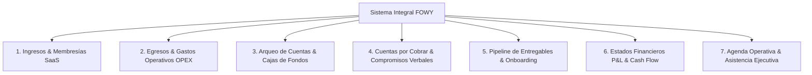
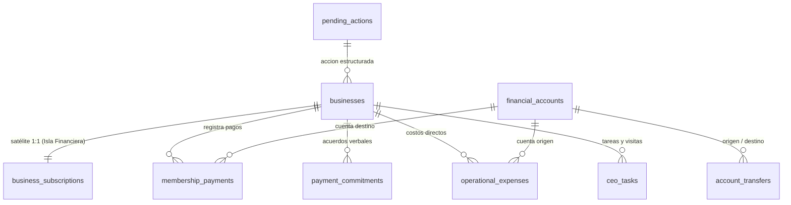

# 💰 PLAN MAESTRO DE CONTABILIDAD INTEGRAL & CONTROL OPERATIVO — FOWY

> ⚠️ **REGLA DE ORO**: Solo se permite la creación o edición de líneas de código y la realización de copias de seguridad (Backups) en GitHub si, y solo si, Cristian (CEO de FOWY) lo solicita expresamente.  
> **Fecha de actualización:** 5 de Septiembre de 2026  
> **Versión:** 2.6 (Blindaje 100%: Tabla Satélite business_subscriptions, Cero Alteración en businesses, RPCs Atómicos 1 RTT y RLS Admin)  
> **Autor:** Antigravity AI (Especialista en Arquitectura SaaS & Finanzas Tecnológicas)  
> **Destinatario:** Cristian (CEO de FOWY)  
> **Documento Complementario:** [`Markdown/Contabilidad/AGENTE.md`](file:///c:/Users/cange/Documents/fowy/Markdown/Contabilidad/AGENTE.md) (Especificación técnica del Agente CFO & Secretaria)  
> **Estado:** Documento Estratégico y de Arquitectura en vigor  

---

## 1. Diagnóstico del Negocio: El Salto de 0 a Escala

FOWY se encuentra en plena fase de expansión comercial activa con negocios registrados en producción continua (cifra dinámica verificable en vivo en la base de datos de Supabase, respetando la directriz maestra de [INDICE.md](file:///c:/Users/cange/Documents/fowy/Markdown/INDICE.md)). En esta fase ocurre un fenómeno crítico documentado en todas las plataformas SaaS (*Software as a Service*):

```text
  [ 1 - 10 Negocios ]   ──► Se gestiona en la cabeza o notas de WhatsApp (Factible).
  [ 10 - 30 Negocios ]  ──► Aparece la fatiga cognitiva: olvidos de cobro, servicios a medias, visitas olvidadas.
  [ 30 - 100+ Negocios ] ──► Quiebra operativa y de caja si no hay automatización: Fuga de dinero y promesas rotas.
```

### Los Cuatro Grandes Problemas Actuales
1. **Pérdida de recaudación:** Negocios que ya terminaron su periodo de prueba gratuita continúan usando la plataforma sin pagar porque no hay alertas programadas de cobro.
2. **Servicios huérfanos y visitas olvidadas:** Negocios a los que se les prometió sesión de fotos, volantes físicos o una visita presencial de seguimiento quedan a medias por falta de una agenda operativa unificada.
3. **Ceguera de utilidad neta (OPEX invisible):** Se registran los pagos que entran, pero no se descuentan los costos de imprenta, fotógrafo, viáticos de transporte ni el servidor de Supabase ($25 USD). Cobrar $50.000 COP no es ganancia neta si gastaste $35.000 en el volante y el viaje.
4. **Falta de visibilidad de caja real:** El dinero se dispersa entre Nequi, Daviplata, Bancolombia y Efectivo físico en la calle sin un arqueo unificado de liquidez.

---

## 2. Los Pilares de la Contabilidad Integral y el Control Operativo

Para que FOWY opere como una empresa formal, altamente organizada y auditable, el sistema gobierna **7 pilares fundamentales**:



### 🔹 Pilar 1: Ciclo de Suscripciones SaaS (Membresías)
Cada negocio tiene un estado contable automatizado en base de datos:
- **`en_prueba` (Trial):** Conteo regresivo en días (ej. 15 o 30 días gratis).
- **`al_dia` (Activo pagado):** Registra fecha de inicio, fecha de pago y próximo corte.
- **`en_gracia` (Tolerancia comercial):** 3 a 5 días tras el corte para gestionar el cobro sin apagar el servicio.
- **`suspendido` (Mora crítica):** Se oculta temporalmente de la vista pública en `/explorar` hasta la confirmación de pago.

### 🔹 Pilar 2: Control de Egresos y Gastos Operativos (OPEX)
La contabilidad exige registrar cada salida de dinero clasificada por categoría y cuenta de origen:
- **Costos de Infraestructura (Fijos):** Suscripción Supabase Plan Pro ($25 USD/mes), dominios web, herramientas auxiliares.
- **Costos Directos de Adquisición (Variables):** Pago a imprenta por 500/1000 volantes por negocio, honorarios de fotógrafo por sesión gastronómica, stickers QR para mesas.
- **Gastos de Operación y Ventas:** Gasolina, transporte, viáticos de visitas comerciales en la calle.
- **Fórmula contable obligatoria:**  
  $$\text{Utilidad Operativa Neta} = \text{Recaudo Total (Membresías + Banners + Extras)} - \text{Egresos Operativos (OPEX)}$$

### 🔹 Pilar 3: Arqueo de Cuentas y Cajas de Fondos (Bolsillos)
En Colombia el recaudo y gasto ocurre en diferentes canales. Cada transacción se asigna a su cuenta real:
- **Nequi** (Cuenta personal / corporativa)
- **Daviplata**
- **Bancolombia** (Ahorros / QR)
- **Caja Menor (Efectivo en mano)**
- *Objetivo:* Saber en todo momento: *"¿Cuánta liquidez líquida real tenemos y en qué cuenta reposa?"*

### 🔹 Pilar 4: Cartera y Memoria de Compromisos Verbales
Los dueños de restaurantes negocian en persona o por WhatsApp (*"Cristian, cóbreme el 20 que ese día cobro"* o *"Le doy la mitad hoy y la otra mitad el sábado"*).
- El sistema registra estos **acuerdos de pago diferidos** con fecha límite y monto pactado en `payment_commitments`.

### 🔹 Pilar 5: Pipeline de Entregables (Onboarding Comercial)
Evita cobrar a clientes que aún tienen servicios pendientes, protegiendo la reputación de la marca:
- **Fotografía de Menú:** `Pendiente` | `Fotos Tomadas` | `Subidas a Plataforma`.
- **Material Publicitario:** `No contratado` | `En diseño` | `En imprenta` | `Entregado al local`.
- **Stickers QR de Mesa:** `Pendiente` | `Entregado`.
- **Capacitación del Personal:** `Pendiente` | `Realizada`.

### 🔹 Pilar 6: Estados Financieros Estándar Automatizados
El sistema genera sin esfuerzo manual:
1. **Estado de Pérdidas y Ganancias (P&L):** Ingresos brutos vs costos directos de entrega vs costos fijos = Margen bruto y Utilidad neta mensual.
2. **Flujo de Caja Real (Cash Flow):** Entradas efectivas vs salidas reales por semana/mes.
3. **Comprobantes de Pago Consecutivos:** Generación de recibos formales (`REC-001`, `REC-002`) con formato limpio para comprobante a clientes por WhatsApp.

### 🔹 Pilar 7: Agenda Operativa del CEO
Registro y seguimiento de visitas de campo, mandados a imprenta y reuniones presenciales para evitar promesas rotas con los restaurantes.

---

## 3. Panorama de la Solución: Tablero Visual CRM & Asistente Inteligente

El sistema de gestión financiera y operativa se implementa bajo una **arquitectura híbrida**:

```text
┌─────────────────────────────────────────────────────────────────────────────┐
│  TABLERO FINANCIERO & CRM (Pantalla /admin/finanzas)                       │
│  ┌──────────────────┬──────────────────┬──────────────────┬──────────────┐  │
│  │ 🟢 Al Día (18)   │ 🟡 En Prueba (9) │ 🔴 Vencidos (5)  │ Utilidad Mes │  │
│  │ Recaudo: $900.000│ Días promedio: 8 │ Cartera: $250.000│ +$660.000 COP│  │
│  └──────────────────┴──────────────────┴──────────────────┴──────────────┘  │
│                                                                             │
│  [ CAJAS: Nequi: $520k | Daviplata: $150k | Bancolombia: $400k | Efectivo: $150k ]
│                                                                             │
│  ┌────────────────────────────────────────┐ ┌─────────────────────────────┐ │
│  │ 📋 AGENDA DEL CEO (HOY)                │ │ 📊 NEGOCIOS POR ATENDER     │ │
│  │ [ ] 10:00 AM: Visitar Kaprichos        │ │ • Asados Diana | Al Día     │ │
│  │ [ ] Mandar volantes de Maye Ricuras    │ │ • Sazón Del Campo | Fotos ⏳│ │
│  │ [x] Cobrar $50.000 a Asados Diana      │ │ • Deliburger | En Prueba (3)│ │
│  └────────────────────────────────────────┘ └─────────────────────────────┘ │
│                                                                             │
│                                                        ┌─────────────────┐  │
│                                                        │ 🤖 BOTÓN FLOTANTE│  │
│                                                        │   "FOWY COPILOT"│  │
│                                                        │  [ 2 Tareas Hoy]│  │
│                                                        └─────────────────┘  │
└─────────────────────────────────────────────────────────────────────────────┘
```

1. **La Interfaz Web (`/admin/finanzas`):** Para cuando Cristian está frente al computador y necesita el panorama general visual en 3 segundos (semáforos, saldos en cuentas y tabla de estados).
2. **El Agente Autónomo (Web & WhatsApp):** Para cuando Cristian está en la calle y necesita dictar audios, consultar tareas o recibir el resumen matutino a las 8:00 AM.  
   *(Toda la arquitectura, prompts, herramientas y conexiones del agente se encuentran detalladas en [`Markdown/Contabilidad/AGENTE.md`](file:///c:/Users/cange/Documents/fowy/Markdown/Contabilidad/AGENTE.md)).*

---

## 4. El Modelo de Datos Maestro en Supabase

A continuación se detalla el esquema DDL formal de tablas aditivas que dan soporte al sistema contable:



### 1. Tabla Satélite de Suscripciones & Onboarding (`business_subscriptions`):
> 🛡️ **REGLA DE ORO DE ARQUITECTURA:** La tabla madre `businesses` queda **100% VIRGEN, PURA E INTOCABLE**. Toda la información financiera, de cortes de membresía y seguimiento de entregables se aísla en esta entidad satélite 1:1. La IA y el módulo de finanzas solo operan sobre esta tabla satélite, eliminando cualquier riesgo de colateral en el mapa o en los menús de comensales.

```sql
CREATE TABLE IF NOT EXISTS business_subscriptions (
    business_id UUID PRIMARY KEY REFERENCES businesses(id) ON DELETE CASCADE,
    subscription_status VARCHAR(20) NOT NULL DEFAULT 'trial', -- 'trial', 'active', 'grace_period', 'suspended'
    trial_ends_at TIMESTAMPTZ DEFAULT (NOW() + INTERVAL '15 days'),
    next_billing_date TIMESTAMPTZ,
    monthly_fee NUMERIC(10,2) DEFAULT 50000.00,
    billing_notes TEXT,
    -- Entregables y Onboarding comercial
    onboarding_photos VARCHAR(30) DEFAULT 'pending', -- 'pending', 'taken', 'uploaded'
    onboarding_flyers VARCHAR(30) DEFAULT 'none',    -- 'none', 'in_design', 'printed', 'delivered'
    onboarding_stickers_qr VARCHAR(30) DEFAULT 'pending', -- 'pending', 'delivered'
    onboarding_menu_ready BOOLEAN DEFAULT FALSE,
    created_at TIMESTAMPTZ DEFAULT NOW(),
    updated_at TIMESTAMPTZ DEFAULT NOW()
);
```

### 2. Tabla de Cuentas Financieras y Arqueo de Cajas (`financial_accounts`):
```sql
CREATE TABLE IF NOT EXISTS financial_accounts (
    id UUID PRIMARY KEY DEFAULT gen_random_uuid(),
    code VARCHAR(30) UNIQUE NOT NULL, -- 'nequi', 'daviplata', 'bancolombia', 'cash', 'other'
    name VARCHAR(50) NOT NULL,
    current_balance NUMERIC(12,2) DEFAULT 0.00,
    account_number VARCHAR(50),
    is_active BOOLEAN DEFAULT TRUE,
    updated_at TIMESTAMPTZ DEFAULT NOW()
);
```

### 3. Tabla de Pagos de Membresías y Recibos Consecutivos (`membership_payments`):
```sql
CREATE TABLE IF NOT EXISTS membership_payments (
    id UUID PRIMARY KEY DEFAULT gen_random_uuid(),
    receipt_number SERIAL UNIQUE, -- Consecutivo automático para comprobantes (ej: REC-001)
    business_id UUID REFERENCES businesses(id) ON DELETE CASCADE,
    account_id UUID REFERENCES financial_accounts(id),
    amount NUMERIC(10,2) NOT NULL,
    payment_method VARCHAR(30) NOT NULL, -- 'nequi', 'daviplata', 'bancolombia', 'cash'
    is_partial BOOLEAN DEFAULT FALSE,    -- Soporte para abonos parciales (ej: $25.000)
    commitment_id UUID REFERENCES payment_commitments(id) ON DELETE SET NULL, -- Enlace con acuerdo verbal
    period_start TIMESTAMPTZ NOT NULL,
    period_end TIMESTAMPTZ NOT NULL,
    proof_url TEXT,
    notes TEXT,
    created_at TIMESTAMPTZ DEFAULT NOW(),
    registered_by UUID REFERENCES auth.users(id)
);
```

### 4. Tabla de Egresos y Gastos Operativos (`operational_expenses`):
```sql
CREATE TABLE IF NOT EXISTS operational_expenses (
    id UUID PRIMARY KEY DEFAULT gen_random_uuid(),
    account_id UUID REFERENCES financial_accounts(id),
    category VARCHAR(40) NOT NULL, -- 'infrastructure', 'flyers_printing', 'photography', 'transport', 'marketing', 'other'
    amount NUMERIC(10,2) NOT NULL,
    description TEXT NOT NULL,
    related_business_id UUID REFERENCES businesses(id) ON DELETE SET NULL,
    receipt_proof_url TEXT,
    expense_date DATE DEFAULT CURRENT_DATE,
    created_at TIMESTAMPTZ DEFAULT NOW(),
    registered_by UUID REFERENCES auth.users(id)
);
```

### 5. Tabla de Compromisos y Acuerdos de Pago Verbales (`payment_commitments`):
```sql
CREATE TABLE IF NOT EXISTS payment_commitments (
    id UUID PRIMARY KEY DEFAULT gen_random_uuid(),
    business_id UUID REFERENCES businesses(id) ON DELETE CASCADE,
    agreed_amount NUMERIC(10,2) NOT NULL,
    agreed_date DATE NOT NULL,
    notes TEXT NOT NULL,
    status VARCHAR(20) DEFAULT 'pending', -- 'pending', 'fulfilled', 'renegotiated', 'broken'
    created_at TIMESTAMPTZ DEFAULT NOW(),
    registered_by UUID REFERENCES auth.users(id)
);
```

### 6. Tabla de Agenda del CEO & Tareas de Campo (`ceo_tasks`):
```sql
CREATE TABLE IF NOT EXISTS ceo_tasks (
    id UUID PRIMARY KEY DEFAULT gen_random_uuid(),
    task_type VARCHAR(30) NOT NULL, -- 'visita', 'impresion_volantes', 'fotos', 'reunion', 'cobro', 'otro'
    title TEXT NOT NULL,            -- "Visita a Kaprichos para revisar menú digital"
    business_id UUID REFERENCES businesses(id) ON DELETE SET NULL,
    due_date DATE NOT NULL,         -- Fecha para el recordatorio
    due_time TIME,                  -- Hora puntual opcional (ej: 10:00:00)
    priority VARCHAR(10) DEFAULT 'media', -- 'alta', 'media', 'baja'
    status VARCHAR(20) DEFAULT 'pending', -- 'pending', 'completed', 'rescheduled', 'cancelled'
    notes TEXT,
    created_at TIMESTAMPTZ DEFAULT NOW(),
    registered_by UUID REFERENCES auth.users(id)
);
```

### 7. Tabla de Bitácora y Balances Diarios Inmutables (`daily_financial_reports`):
```sql
CREATE TABLE IF NOT EXISTS daily_financial_reports (
    id UUID PRIMARY KEY DEFAULT gen_random_uuid(),
    report_date DATE NOT NULL UNIQUE DEFAULT CURRENT_DATE,
    total_active_businesses INT NOT NULL,
    businesses_in_trial INT NOT NULL,
    businesses_due_today INT NOT NULL,
    businesses_in_grace INT NOT NULL,
    businesses_suspended INT NOT NULL,
    -- Balance económico del día
    daily_income NUMERIC(10,2) DEFAULT 0.00,
    daily_expenses NUMERIC(10,2) DEFAULT 0.00,
    daily_net NUMERIC(10,2) DEFAULT 0.00,
    -- Métricas acumuladas de mes
    month_to_date_income NUMERIC(10,2) DEFAULT 0.00,
    month_to_date_expenses NUMERIC(10,2) DEFAULT 0.00,
    month_to_date_net NUMERIC(10,2) DEFAULT 0.00,
    pending_receivables NUMERIC(10,2) DEFAULT 0.00,
    -- Contenido directivo y de secretaría
    executive_summary TEXT NOT NULL,
    morning_briefing_text TEXT NOT NULL,
    tasks_scheduled_today JSONB DEFAULT '[]'::jsonb,
    commitments_due JSONB DEFAULT '[]'::jsonb,
    urgent_actions JSONB DEFAULT '[]'::jsonb,
    ai_cfo_recommendations TEXT,
    created_at TIMESTAMPTZ DEFAULT NOW()
);
```

### 8. Tabla de Traspasos y Transferencias entre Cuentas (`account_transfers`):
Permite registrar retiros y traspasos entre Nequi, Daviplata, Bancolombia y Efectivo sin alterar el P&L mensual (el dinero no se gastó, solo cambió de bolsillo):
```sql
CREATE TABLE IF NOT EXISTS account_transfers (
    id UUID PRIMARY KEY DEFAULT gen_random_uuid(),
    source_account_id UUID REFERENCES financial_accounts(id) NOT NULL,
    destination_account_id UUID REFERENCES financial_accounts(id) NOT NULL,
    amount NUMERIC(10,2) NOT NULL CHECK (amount > 0),
    fee NUMERIC(10,2) DEFAULT 0.00, -- Comisión bancaria si aplica (esto sí cuenta como gasto)
    notes TEXT,
    created_at TIMESTAMPTZ DEFAULT NOW(),
    registered_by UUID REFERENCES auth.users(id)
);
```

### 9. Tabla de Acciones Pendientes del Agente con TTL (`pending_actions`):
Soporte de confirmación en dos pasos para Web y WhatsApp. La acción estructurada se almacena aquí con TTL de 10 minutos para ejecutarse en <50 ms al responder "CONFIRMADO" sin re-invocar al LLM:
```sql
CREATE TABLE IF NOT EXISTS pending_actions (
    id UUID PRIMARY KEY DEFAULT gen_random_uuid(),
    channel VARCHAR(20) NOT NULL, -- 'whatsapp', 'web'
    action_type VARCHAR(50) NOT NULL, -- 'register_payment', 'register_expense', 'register_transfer', 'schedule_task'
    payload JSONB NOT NULL,
    status VARCHAR(20) DEFAULT 'pending', -- 'pending', 'executed', 'cancelled', 'expired', 'superseded'
    expires_at TIMESTAMPTZ NOT NULL DEFAULT (NOW() + INTERVAL '10 minutes'),
    created_at TIMESTAMPTZ DEFAULT NOW(),
    executed_at TIMESTAMPTZ,
    user_id UUID REFERENCES auth.users(id)
);
CREATE INDEX IF NOT EXISTS idx_pending_actions_active ON pending_actions(channel, status, expires_at);
```

### 10. Tabla de Idempotencia y Deduplicación de Webhooks (`processed_webhook_events`):
Previene la ejecución duplicada de audios o mensajes ante reintentos automáticos de red de Evolution API o WhatsApp:
```sql
CREATE TABLE IF NOT EXISTS processed_webhook_events (
    message_id VARCHAR(100) PRIMARY KEY,
    sender_phone VARCHAR(30) NOT NULL,
    event_type VARCHAR(30) NOT NULL,
    processed_at TIMESTAMPTZ DEFAULT NOW()
);
```

---

### 4.11 Procedimientos Transaccionales Atómicos (Cero Inconsistencias)

Para garantizar integridad contable absoluta (100% ACID), se ejecutan procedimientos en PostgreSQL que consolidan la transacción en 1 solo viaje de red (*1 RTT*):

```sql
-- 1. Aplicación Atómica de Pago Confirmado de Membresía (con soporte de Abonos Parciales)
CREATE OR REPLACE FUNCTION apply_confirmed_membership_payment(
    p_business_id UUID,
    p_account_id UUID,
    p_amount NUMERIC,
    p_payment_method VARCHAR,
    p_extension_days INT DEFAULT 30,
    p_notes TEXT DEFAULT NULL,
    p_is_partial BOOLEAN DEFAULT FALSE,
    p_commitment_id UUID DEFAULT NULL,
    p_remaining_amount NUMERIC DEFAULT 0.00,
    p_remaining_due_date DATE DEFAULT NULL
)
RETURNS JSONB
LANGUAGE plpgsql
SECURITY DEFINER
AS $$
DECLARE
    v_receipt_number INT;
    v_new_billing_date TIMESTAMPTZ;
    v_business_name TEXT;
    v_new_commitment_id UUID := NULL;
BEGIN
    -- Validar existencia del negocio
    SELECT name INTO v_business_name FROM businesses WHERE id = p_business_id;
    IF NOT FOUND THEN
        RAISE EXCEPTION 'Negocio no encontrado';
    END IF;

    -- 1. Insertar el pago y obtener consecutivo oficial
    INSERT INTO membership_payments (
        business_id, account_id, amount, payment_method, 
        period_start, period_end, notes, is_partial, commitment_id
    ) VALUES (
        p_business_id, p_account_id, p_amount, p_payment_method,
        NOW(), NOW() + (p_extension_days || ' days')::INTERVAL, 
        p_notes, p_is_partial, p_commitment_id
    ) RETURNING receipt_number INTO v_receipt_number;

    -- 2. Incrementar saldo en la cuenta financiera destino
    UPDATE financial_accounts
    SET current_balance = current_balance + p_amount, updated_at = NOW()
    WHERE id = p_account_id;

    -- 3. Actualizar estado y fecha de corte en la tabla satélite (business_subscriptions)
    INSERT INTO business_subscriptions (business_id, subscription_status, next_billing_date)
    VALUES (
        p_business_id, 
        'active', 
        NOW() + (p_extension_days || ' days')::INTERVAL
    )
    ON CONFLICT (business_id) DO UPDATE
    SET subscription_status = 'active',
        next_billing_date = CASE 
            WHEN business_subscriptions.next_billing_date IS NULL OR business_subscriptions.next_billing_date < NOW() THEN NOW() + (p_extension_days || ' days')::INTERVAL
            ELSE business_subscriptions.next_billing_date + (p_extension_days || ' days')::INTERVAL
        END,
        updated_at = NOW()
    RETURNING next_billing_date INTO v_new_billing_date;

    -- 4. Si estaba ligado a un compromiso verbal previo, marcarlo como cumplido
    IF p_commitment_id IS NOT NULL THEN
        UPDATE payment_commitments SET status = 'fulfilled' WHERE id = p_commitment_id;
    END IF;

    -- 5. Blindaje de Pagos Parciales: si es abono y queda saldo, crear cartera automáticamente
    IF p_is_partial AND p_remaining_amount > 0 THEN
        INSERT INTO payment_commitments (
            business_id, agreed_amount, agreed_date, notes, status
        ) VALUES (
            p_business_id, 
            p_remaining_amount, 
            COALESCE(p_remaining_due_date, CURRENT_DATE + 7), 
            'Saldo pendiente de abono parcial (Recibo REC-' || LPAD(v_receipt_number::TEXT, 4, '0') || ')',
            'pending'
        ) RETURNING id INTO v_new_commitment_id;
    END IF;

    RETURN jsonb_build_object(
        'success', true,
        'receipt_number', v_receipt_number,
        'receipt_code', 'REC-' || LPAD(v_receipt_number::TEXT, 4, '0'),
        'business_name', v_business_name,
        'amount', p_amount,
        'is_partial', p_is_partial,
        'remaining_amount', p_remaining_amount,
        'remaining_commitment_id', v_new_commitment_id,
        'next_billing_date', v_new_billing_date
    );
END;
$$;

-- 2. Aplicación Atómica de Transferencia entre Cuentas (Sin alterar P&L)
CREATE OR REPLACE FUNCTION apply_account_transfer(
    p_source_account_id UUID,
    p_destination_account_id UUID,
    p_amount NUMERIC,
    p_fee NUMERIC DEFAULT 0.00,
    p_notes TEXT DEFAULT NULL
)
RETURNS JSONB
LANGUAGE plpgsql
SECURITY DEFINER
AS $$
BEGIN
    -- Descontar de cuenta origen
    UPDATE financial_accounts 
    SET current_balance = current_balance - (p_amount + p_fee), updated_at = NOW()
    WHERE id = p_source_account_id;

    -- Acreditar en cuenta destino
    UPDATE financial_accounts 
    SET current_balance = current_balance + p_amount, updated_at = NOW()
    WHERE id = p_destination_account_id;

    -- Registrar el traspaso
    INSERT INTO account_transfers (source_account_id, destination_account_id, amount, fee, notes)
    VALUES (p_source_account_id, p_destination_account_id, p_amount, p_fee, p_notes);

    -- Si hubo comisión bancaria, registrarla como gasto operativo de infraestructura/bancario
    IF p_fee > 0 THEN
        INSERT INTO operational_expenses (account_id, category, amount, description, expense_date)
        VALUES (p_source_account_id, 'infrastructure', p_fee, 'Comisión por transferencia bancaria', CURRENT_DATE);
    END IF;

    RETURN jsonb_build_object('success', true, 'amount', p_amount, 'fee', p_fee);
END;
$$;

-- 3. Aplicación Atómica de Gasto Operativo Confirmado (OPEX con descuento de caja)
CREATE OR REPLACE FUNCTION apply_confirmed_expense(
    p_account_id UUID,
    p_category VARCHAR,
    p_amount NUMERIC,
    p_description TEXT,
    p_related_business_id UUID DEFAULT NULL,
    p_expense_date DATE DEFAULT CURRENT_DATE
)
RETURNS JSONB
LANGUAGE plpgsql
SECURITY DEFINER
AS $$
DECLARE
    v_expense_id UUID;
    v_account_name TEXT;
    v_new_balance NUMERIC;
BEGIN
    -- Validar cuenta financiera
    SELECT name INTO v_account_name FROM financial_accounts WHERE id = p_account_id;
    IF NOT FOUND THEN
        RAISE EXCEPTION 'Cuenta financiera no encontrada';
    END IF;

    -- 1. Insertar el gasto operativo
    INSERT INTO operational_expenses (
        account_id, category, amount, description, 
        related_business_id, expense_date
    ) VALUES (
        p_account_id, p_category, p_amount, p_description, 
        p_related_business_id, p_expense_date
    ) RETURNING id INTO v_expense_id;

    -- 2. Descontar atómicamente el saldo de la cuenta
    UPDATE financial_accounts
    SET current_balance = current_balance - p_amount,
        updated_at = NOW()
    WHERE id = p_account_id
    RETURNING current_balance INTO v_new_balance;

    RETURN jsonb_build_object(
        'success', true,
        'expense_id', v_expense_id,
        'account_name', v_account_name,
        'amount', p_amount,
        'new_balance', v_new_balance
    );
END;
$$;

-- 4. Consulta Atómica del Expediente Comercial 360° (Dossier para el Agente y CRM)
CREATE OR REPLACE FUNCTION get_business_dossier(
    p_business_identifier TEXT
)
RETURNS JSONB
LANGUAGE plpgsql
SECURITY DEFINER
AS $$
DECLARE
    v_biz RECORD;
    v_metrics JSONB;
    v_commitments JSONB;
    v_tasks JSONB;
BEGIN
    -- Buscar negocio por ID, slug o nombre uniendo con la tabla satélite business_subscriptions
    SELECT b.id, b.name, b.slug, 
           COALESCE(bs.subscription_status, 'trial') AS subscription_status, 
           bs.next_billing_date, 
           COALESCE(bs.monthly_fee, 50000.00) AS monthly_fee,
           COALESCE(bs.onboarding_photos, 'pending') AS onboarding_photos, 
           COALESCE(bs.onboarding_flyers, 'none') AS onboarding_flyers, 
           COALESCE(bs.onboarding_stickers_qr, 'pending') AS onboarding_stickers_qr, 
           COALESCE(bs.onboarding_menu_ready, FALSE) AS onboarding_menu_ready
    INTO v_biz
    FROM businesses b
    LEFT JOIN business_subscriptions bs ON bs.business_id = b.id
    WHERE b.id::TEXT = p_business_identifier 
       OR b.slug = p_business_identifier
       OR b.name ILIKE '%' || p_business_identifier || '%'
    ORDER BY (b.name ILIKE p_business_identifier || '%') DESC
    LIMIT 1;

    IF NOT FOUND THEN
        RETURN jsonb_build_object('error', 'Negocio no encontrado');
    END IF;

    -- Métricas de los últimos 30 días agregadas en SQL
    SELECT jsonb_build_object(
        'total_orders_last_30d', COUNT(*),
        'estimated_gross_sales', COALESCE(SUM(total_amount), 0),
        'average_ticket', CASE WHEN COUNT(*) > 0 THEN ROUND(COALESCE(SUM(total_amount), 0) / COUNT(*), 2) ELSE 0 END,
        'fowy_cost_per_order', CASE WHEN COUNT(*) > 0 THEN ROUND(COALESCE(v_biz.monthly_fee, 50000.00) / COUNT(*), 2) ELSE 0 END
    ) INTO v_metrics
    FROM orders
    WHERE business_id = v_biz.id
      AND created_at >= NOW() - INTERVAL '30 days';

    -- Compromisos verbales pendientes
    SELECT jsonb_agg(jsonb_build_object(
        'id', id, 'agreed_amount', agreed_amount, 'agreed_date', agreed_date, 'notes', notes, 'status', status
    )) INTO v_commitments
    FROM payment_commitments
    WHERE business_id = v_biz.id AND status = 'pending';

    -- Tareas o visitas pendientes
    SELECT jsonb_agg(jsonb_build_object(
        'id', id, 'title', title, 'task_type', task_type, 'due_date', due_date, 'due_time', due_time, 'status', status
    )) INTO v_tasks
    FROM ceo_tasks
    WHERE business_id = v_biz.id AND status = 'pending';

    RETURN jsonb_build_object(
        'business', jsonb_build_object(
            'id', v_biz.id,
            'name', v_biz.name,
            'slug', v_biz.slug,
            'subscription_status', v_biz.subscription_status,
            'next_billing_date', v_biz.next_billing_date,
            'monthly_fee', v_biz.monthly_fee,
            'deliverables', jsonb_build_object(
                'photos', v_biz.onboarding_photos,
                'flyers', v_biz.onboarding_flyers,
                'stickers_qr', v_biz.onboarding_stickers_qr,
                'menu_ready', v_biz.onboarding_menu_ready
            )
        ),
        'recent_metrics', v_metrics,
        'pending_commitments', COALESCE(v_commitments, '[]'::jsonb),
        'agenda_tasks', COALESCE(v_tasks, '[]'::jsonb)
    );
END;
$$;
```

---

### 4.12 Políticas de Seguridad Row Level Security (RLS) Blindadas

Para proteger toda la información contable sensible de FOWY, todas las tablas financieras se blindan con RLS exigiendo que solo usuarios con rol de administrador tengan acceso:

```sql
-- Habilitar RLS en todas las tablas financieras y satélites
ALTER TABLE business_subscriptions ENABLE ROW LEVEL SECURITY;
ALTER TABLE financial_accounts ENABLE ROW LEVEL SECURITY;
ALTER TABLE membership_payments ENABLE ROW LEVEL SECURITY;
ALTER TABLE operational_expenses ENABLE ROW LEVEL SECURITY;
ALTER TABLE payment_commitments ENABLE ROW LEVEL SECURITY;
ALTER TABLE ceo_tasks ENABLE ROW LEVEL SECURITY;
ALTER TABLE daily_financial_reports ENABLE ROW LEVEL SECURITY;
ALTER TABLE account_transfers ENABLE ROW LEVEL SECURITY;
ALTER TABLE pending_actions ENABLE ROW LEVEL SECURITY;
ALTER TABLE processed_webhook_events ENABLE ROW LEVEL SECURITY;

-- Política Maestra: Solo Administradores Verificados pueden consultar y operar finanzas
DO $$
DECLARE
    tbl text;
    tables text[] := ARRAY[
        'business_subscriptions', 'financial_accounts', 'membership_payments', 
        'operational_expenses', 'payment_commitments', 'ceo_tasks', 
        'daily_financial_reports', 'account_transfers', 'pending_actions', 
        'processed_webhook_events'
    ];
BEGIN
    FOREACH tbl IN ARRAY tables LOOP
        EXECUTE format('
            DROP POLICY IF EXISTS admin_finance_isolation_policy ON %I;
            CREATE POLICY admin_finance_isolation_policy ON %I
            FOR ALL TO authenticated
            USING ((auth.jwt() ->> ''role'') = ''admin'')
            WITH CHECK ((auth.jwt() ->> ''role'') = ''admin'');
        ', tbl, tbl);
    END LOOP;
END;
$$;

-- Blindaje de Funciones RPC: Solo accesibles para administradores autenticados o service_role
REVOKE EXECUTE ON FUNCTION apply_confirmed_membership_payment FROM public;
GRANT EXECUTE ON FUNCTION apply_confirmed_membership_payment TO authenticated, service_role;

REVOKE EXECUTE ON FUNCTION apply_account_transfer FROM public;
GRANT EXECUTE ON FUNCTION apply_account_transfer TO authenticated, service_role;

REVOKE EXECUTE ON FUNCTION apply_confirmed_expense FROM public;
GRANT EXECUTE ON FUNCTION apply_confirmed_expense TO authenticated, service_role;

REVOKE EXECUTE ON FUNCTION get_business_dossier FROM public;
GRANT EXECUTE ON FUNCTION get_business_dossier TO authenticated, service_role;
```

---

## 5. Matriz de Riesgos & Protocolos de Blindaje Integral

| Vector de Riesgo | Gravedad Potencial | Nivel tras Blindaje | Mecanismo de Protección Aplicado |
| :--- | :---: | :---: | :--- |
| **Suspensión errónea de restaurantes** | 🔴 Crítica | 🟢 Blindado | Prohibición absoluta de apagado automático. El sistema solo emite alertas; la suspensión requiere clic manual del CEO. |
| **Timeout de 10s en Vercel Free** | 🟠 Alta | 🟢 Blindado | Gemini 1.5 Flash (<800ms) + auditoría SQL desacoplada en Supabase Pro (`pg_cron` / Edge Function). |
| **Alucinación de fechas o nombres** | 🟡 Media | 🟢 Blindado | Desambiguación con similitud <95% y confirmación en 2 pasos antes de guardar en DB. |
| **Cálculo de márgenes sin gastos** | 🔴 Alta | 🟢 Blindado | Registro formal de OPEX en `operational_expenses`; la utilidad siempre descuenta costos reales. |
| **Sobrecarga en clientes/comensales** | 🟢 Baja | 🟢 Cero Impacto | Tablas contables y de agenda aisladas; los comensales en `/explorar` jamás tocan estos datos. |
| **Filtración de datos privados** | 🔴 Alta | 🟢 Blindado | `GEMINI_API_KEY` privada en servidor; verificación estricta de JWT de Supabase con rol `admin`. |
| **Regresiones en código existente** | 🔴 Alta | 🟢 Blindado | Cumplimiento estricto de la Ley del Remolque (arquitectura modular en isla, 100% código nuevo). |

---

## 6. 🛑 CÓDIGO ROJO: LAS 4 PROHIBICIONES INQUEBRANTABLES

En cumplimiento absoluto con **[Markdown/conceptos.md](file:///c:/Users/cange/Documents/fowy/Markdown/conceptos.md)**:

1. **🛑 Daño en Base de Datos:**  
   - Prohibido ejecutar `UPDATE businesses` masivos sin `WHERE id = ...`.  
   - Prohibido ejecutar `DROP TABLE` o alterar columnas existentes en PostgreSQL.  
   - Prohibido mantener transacciones SQL abiertas esperando respuestas de la API de IA.
2. **🛑 Daño en el Código & Despliegues:**  
   - Prohibido modificar tipos globales en `src/types/supabase.ts`. Todos los tipos de finanzas y agenda se declaran en `src/types/finance.ts`.  
   - Prohibido subir cambios a Git o Vercel sin haber ejecutado y verificado `npm run build` localmente con cero errores de TypeScript y ESLint.
3. **🛑 Daño en la Experiencia de Comensales:**  
   - Prohibido tocar o modificar las funciones RPC congeladas `get_businesses_in_viewport` y `get_business_menu_payload`.  
   - Prohibido modificar [`useExplorerManager.ts`](file:///c:/Users/cange/Documents/fowy/src/hooks/useExplorerManager.ts) o [`useOrderManager.ts`](file:///c:/Users/cange/Documents/fowy/src/hooks/useOrderManager.ts).
4. **🛑 Autonomía Destructiva de la IA:**  
   - Prohibido otorgar credenciales con permisos de borrado (`DELETE`) a las funciones del Copilot.  
   - Prohibido aplicar pagos o modificar estados a ciegas: toda acción exige **Confirmación en Dos Pasos** con aprobación física de Cristian.

---

## 7. Plan de Ejecución por Fases (Roadmap)

```text
  [ FASE A: Cimientos Contables & Agenda ] ──► Tablas en Supabase: cuentas, pagos, gastos, agenda y reportes.
  [ FASE B: Tablero Visual CRM & Agenda ]  ──► Pantalla /admin/finanzas con semáforos, cajas y checklist diario.
  [ FASE C: Copilot Web (CFO & Secretaria) ] ──► Chat web flotante con Gemini Flash, dictado y confirmación.
  [ FASE D: Enlace WhatsApp Evolution API ]──► Despliegue Docker QR, Webhook bidireccional y Morning Briefing 8 AM.
```

### Fase A: Cimientos de Datos & Cuentas (1 día)
- Ejecutar scripts DDL aditivos en Supabase: `financial_accounts`, `membership_payments`, `operational_expenses`, `payment_commitments`, `ceo_tasks` y `daily_financial_reports`.
- Inicializar las cuentas base (Nequi, Daviplata, Bancolombia, Efectivo).
- Configurar el estado de suscripción inicial de los negocios activos en producción.

### Fase B: Tablero Visual CRM & Agenda en `/admin/finanzas` (2 días)
- Resumen de métricas superiores: Recaudo mes, Gastos OPEX mes, Utilidad Neta real y Cartera por cobrar.
- Desglose de liquidez por cuenta (Nequi, Daviplata, Bancolombia, Efectivo).
- Bloque interactivo **"Agenda del CEO"**: checklist de visitas y tareas de hoy con botón `[Hecho]`.
- Tabla de negocios con filtros: *Al Día, En Prueba, Por Cobrar, Compromisos Hoy*.
- Pestaña dedicada: **"Bitácora Diaria del CFO"** para consultar el histórico de reportes automáticos.

### Fase C: Integración del Copilot Web (CFO & Secretaria) (2 días)
- Endpoint seguro `/api/admin/copilot` con Google Gemini 1.5 Flash.
- Herramientas Function Calling documentadas en [`Markdown/Contabilidad/AGENTE.md`](file:///c:/Users/cange/Documents/fowy/Markdown/Contabilidad/AGENTE.md).
- Componente flotante de chat con soporte de dictado por voz y tarjetas interactivas de previsualización antes de impactar la base de datos.

### Fase D: Enlace WhatsApp con Evolution API (1 día)
- Despliegue del contenedor Docker de Evolution API en Render / Koyeb (Plan Free) y escaneo de código QR para vincular el WhatsApp personal de Cristian.
- Creación del Webhook seguro `src/app/api/webhooks/whatsapp/route.ts` con filtro por número autorizado (`CEO_PHONE_NUMBER`).
- Configuración del Cron nocturno (11:59 PM) y del despacho del **Morning Briefing de las 8:00 AM directamente a tu WhatsApp**.

---

## 8. Conclusión Ejecutiva

El plan maestro de contabilidad establece las bases sólidas para gobernar las finanzas de FOWY:
1. **Control Financiero Riguroso:** Control de OPEX, cajas y cuentas bancarias, cálculo de utilidad neta y comprobantes formales.
2. **Tablero Visual de Alto Impacto:** Pantalla `/admin/finanzas` para tener visibilidad de verde, amarillo y rojo en 3 segundos.
3. **Agente Autónomo Desacoplado:** Toda la lógica, conexiones, tools y parámetros del agente se gobiernan en su documento especializado [`Markdown/Contabilidad/AGENTE.md`](file:///c:/Users/cange/Documents/fowy/Markdown/Contabilidad/AGENTE.md).

---
*Documento maestro actualizado y en vigor — FOWY 2026*
