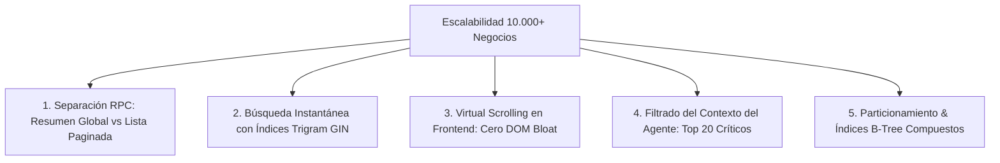

# ⚡ GUÍA DE ALTO RENDIMIENTO & ARQUITECTURA ZERO-DEBT — ESCALABILIDAD 10.000+ NEGOCIOS

> ⚠️ **REGLA DE ORO**: Solo se permite la creación o edición de líneas de código y la realización de copias de seguridad (Backups) en GitHub si, y solo si, Cristian (CEO de FOWY) lo solicita expresamente.  
> **Fecha de actualización:** 5 de Septiembre de 2026  
> **Versión:** 2.3 (Blindaje 100%: Tabla Satélite business_subscriptions, Cero Alteración en businesses, P&L Completo y GIN Trigram)  
> **Ubicación:** `Markdown/Contabilidad/Optimizacion-iA.md`  
> **Documentos Relacionados:** [`CONTABILIDAD.md`](file:///c:/Users/cange/Documents/fowy/Markdown/Contabilidad/CONTABILIDAD.md) | [`AGENTE.md`](file:///c:/Users/cange/Documents/fowy/Markdown/Contabilidad/AGENTE.md)  
> **Destinatario:** Cristian (CEO de FOWY)  

---

## 1. El Reto de los 10.000+ Negocios: Erradicación del Colapso de Red y Memoria

Cuando una plataforma SaaS como FOWY escala de 30 a **10.000 o 100.000 negocios registrados**, los patrones clásicos de desarrollo web fallan estrepitosamente:

```text
  [ Con 50 Negocios ]    ──► Descargar todo en un solo JSON funciona sin problemas (40 KB).
  [ Con 10.000 Negocios ] ──► Descargar todo genera un JSON de 4 a 6 MB:
                             ❌ La red 4G/5G tarda 3 a 5 segundos en transferir datos.
                             ❌ El navegador móvil crashea por saturación de memoria RAM (DOM Overload).
                             ❌ El motor SQL ejecuta Sequential Scans bloqueando transacciones.
```

### Metas de Rendimiento Obligatorias para 10.000+ Negocios
* **Payload de Red Inicial:** **< 25 KB** (en lugar de 5 MB).
* **Tiempo de Carga en Pantalla:** **< 100 ms** (Caché local SWR + Skeleton animado).
* **Tasa de Refresco:** **60 FPS fijos** en cualquier teléfono mediante *Virtual Scrolling*.
* **Búsqueda por Nombre:** **< 5 ms** entre 100.000 registros mediante índices Trigram GIN en PostgreSQL.
* **Respuesta de IA por WhatsApp:** **< 1.2 segundos** (Audio nativo directo y lecturas puntuales indexadas).

---

## 2. Los 5 Pilares de Ingeniería para Soportar 10.000+ Negocios



---

## 3. Optimización en Base de Datos: Arquitectura Desacoplada (Supabase Pro)

Para soportar decenas de miles de negocios sin degradación, **se prohíbe terminantemente la descarga masiva de todos los locales en una sola consulta**. La carga se divide en dos funciones RPC altamente optimizadas:

### 3.1 Procedimiento 1: `get_admin_finance_summary()` (Carga Inicial en <15 ms)
Calcula las métricas macro de la empresa de forma puramente agregada en el motor SQL. **Devuelve un payload ultra-ligero de menos de 4 KB**:

```sql
CREATE OR REPLACE FUNCTION get_admin_finance_summary()
RETURNS JSONB
LANGUAGE plpgsql
SECURITY DEFINER
AS $$
DECLARE
    v_income NUMERIC := 0.00;
    v_expenses NUMERIC := 0.00;
    v_paid_count INT := 0;
    v_receivables NUMERIC := 0.00;
    v_metrics JSONB;
    v_accounts JSONB;
    v_today_tasks JSONB;
    v_counts JSONB;
BEGIN
    -- 1. Ingresos y pagos del mes
    SELECT 
        COALESCE(SUM(amount), 0),
        COUNT(*)
    INTO v_income, v_paid_count
    FROM membership_payments 
    WHERE period_start >= date_trunc('month', NOW() AT TIME ZONE 'America/Bogota');

    -- 2. Egresos y gastos operativos (OPEX) del mes
    SELECT COALESCE(SUM(amount), 0)
    INTO v_expenses
    FROM operational_expenses
    WHERE expense_date >= (date_trunc('month', NOW() AT TIME ZONE 'America/Bogota'))::DATE;

    -- 3. Cartera pendiente (compromisos verbales activos)
    SELECT COALESCE(SUM(agreed_amount), 0)
    INTO v_receivables
    FROM payment_commitments
    WHERE status = 'pending';

    -- 4. Consolidar métricas P&L y flujo de caja real (1 RTT en DB)
    v_metrics := jsonb_build_object(
        'month_income', v_income,
        'month_expenses', v_expenses,
        'net_profit', v_income - v_expenses,
        'pending_receivables', v_receivables,
        'total_paid_count', v_paid_count
    );

    -- 5. Conteo de negocios por semáforo 100% resiliente (combina businesses con satélite)
    SELECT jsonb_build_object(
        'active', COUNT(*) FILTER (WHERE COALESCE(bs.subscription_status, 'trial') = 'active'),
        'trial', COUNT(*) FILTER (WHERE COALESCE(bs.subscription_status, 'trial') = 'trial'),
        'grace_period', COUNT(*) FILTER (WHERE COALESCE(bs.subscription_status, 'trial') = 'grace_period'),
        'suspended', COUNT(*) FILTER (WHERE COALESCE(bs.subscription_status, 'trial') = 'suspended'),
        'total', COUNT(b.id)
    ) INTO v_counts 
    FROM businesses b
    LEFT JOIN business_subscriptions bs ON bs.business_id = b.id;

    -- 6. Arqueo de cajas de fondos activas
    SELECT jsonb_agg(jsonb_build_object(
        'id', id, 'code', code, 'name', name, 'current_balance', current_balance
    )) INTO v_accounts FROM financial_accounts WHERE is_active = TRUE;

    -- 7. Agenda de visitas y mandados del CEO para hoy
    SELECT jsonb_agg(jsonb_build_object(
        'id', id, 'title', title, 'task_type', task_type, 'due_time', due_time, 'status', status, 'business_id', business_id
    )) INTO v_today_tasks FROM ceo_tasks WHERE due_date = CURRENT_DATE AND status = 'pending';

    RETURN jsonb_build_object(
        'metrics', v_metrics,
        'counts', v_counts,
        'accounts', COALESCE(v_accounts, '[]'::jsonb),
        'today_tasks', COALESCE(v_today_tasks, '[]'::jsonb)
    );
END;
$$;
```

---

### 3.2 Procedimiento 2: `get_admin_businesses_billing_page()` (Paginación Server-Side)
La tabla de negocios **solo descarga 30 o 50 registros por página** según el filtro activo (`todos`, `vencidos`, `en_prueba`) o el término de búsqueda. El payload nunca supera los **25 KB**:

```sql
CREATE OR REPLACE FUNCTION get_admin_businesses_billing_page(
    p_status VARCHAR DEFAULT 'all',
    p_search TEXT DEFAULT '',
    p_limit INT DEFAULT 30,
    p_offset INT DEFAULT 0
)
RETURNS JSONB
LANGUAGE plpgsql
SECURITY DEFINER
AS $$
DECLARE
    v_rows JSONB;
    v_total_filtered INT;
BEGIN
    -- Conteo rápido de coincidencias filtradas uniendo tabla madre con tabla satélite
    SELECT COUNT(*) INTO v_total_filtered
    FROM businesses b
    LEFT JOIN business_subscriptions bs ON bs.business_id = b.id
    WHERE (p_status = 'all' OR COALESCE(bs.subscription_status, 'trial') = p_status)
      AND (p_search = '' OR b.name ILIKE '%' || p_search || '%');

    -- Selección quirúrgica con paginación
    SELECT jsonb_agg(jsonb_build_object(
        'id', id,
        'name', name,
        'subscription_status', subscription_status,
        'trial_ends_at', trial_ends_at,
        'next_billing_date', next_billing_date,
        'monthly_fee', monthly_fee,
        'deliverables', deliverables
    )) INTO v_rows
    FROM (
        SELECT b.id, b.name, 
               COALESCE(bs.subscription_status, 'trial') AS subscription_status, 
               bs.trial_ends_at, 
               bs.next_billing_date, 
               COALESCE(bs.monthly_fee, 50000.00) AS monthly_fee, 
               COALESCE(bs.deliverables, '{}'::jsonb) AS deliverables
        FROM businesses b
        LEFT JOIN business_subscriptions bs ON bs.business_id = b.id
        WHERE (p_status = 'all' OR COALESCE(bs.subscription_status, 'trial') = p_status)
          AND (p_search = '' OR b.name ILIKE '%' || p_search || '%')
        ORDER BY 
            CASE WHEN COALESCE(bs.subscription_status, 'trial') = 'grace_period' THEN 1
                 WHEN COALESCE(bs.subscription_status, 'trial') = 'trial' THEN 2
                 ELSE 3 END,
            bs.next_billing_date ASC NULLS LAST
        LIMIT p_limit OFFSET p_offset
    ) sub;

    RETURN jsonb_build_object(
        'data', COALESCE(v_rows, '[]'::jsonb),
        'total', v_total_filtered,
        'limit', p_limit,
        'offset', p_offset
    );
END;
$$;
```

---

### 3.3 Índices de Alto Rendimiento para 10.000+ Registros

Para evitar cualquier escaneo secuencial en tablas con millones de filas, se despliegan índices especializados:

```sql
-- 1. Búsqueda instantánea de nombres entre 100.000 restaurantes (<5ms) mediante Trigram GIN
CREATE EXTENSION IF NOT EXISTS pg_trgm;
CREATE INDEX IF NOT EXISTS idx_businesses_name_trgm 
ON businesses USING gin (name gin_trgm_ops);

-- 2. Índice B-Tree compuesto para el semáforo y orden de cortes en la tabla satélite
CREATE INDEX IF NOT EXISTS idx_business_subscriptions_status_date 
ON business_subscriptions(subscription_status, next_billing_date ASC NULLS LAST);

-- 3. Consultas de cobros históricos y filtro por mes sin escanear la tabla entera
CREATE INDEX IF NOT EXISTS idx_membership_payments_period_lookup 
ON membership_payments(period_start DESC, business_id);

-- 4. Gastos OPEX por fecha descendente
CREATE INDEX IF NOT EXISTS idx_operational_expenses_date 
ON operational_expenses(expense_date DESC);

-- 5. Agenda de campo del CEO (<2ms)
CREATE INDEX IF NOT EXISTS idx_ceo_tasks_due_status 
ON ceo_tasks(due_date, status);

-- 6. Cola efímera de confirmación rápida en 2 pasos (<0.5ms mediante Índice Parcial en RAM)
CREATE INDEX IF NOT EXISTS idx_pending_actions_active 
ON pending_actions(channel, expires_at) 
WHERE status = 'pending';

-- 7. Traspasos entre cuentas por fecha descendente
CREATE INDEX IF NOT EXISTS idx_account_transfers_created 
ON account_transfers(created_at DESC);
```

---

## 4. Optimización Frontend: Virtual Scrolling & SWR Infinite

Renderizar 10.000 nodos HTML simultáneos en el DOM satura la memoria del navegador. Se implementan dos técnicas estándar de alto rendimiento:

### 4.1 Virtualización de Filas (`Virtual Scrolling`)
Utilizando `@tanstack/react-virtual`, el navegador **solo dibuja en el DOM las 10 o 12 filas visibles en la pantalla del celular**:
- Si la tabla tiene 10.000 registros cargados en memoria, el navegador solo renderiza 12 elementos HTML.
- **Resultado:** Desplazamiento fluido a **60 FPS** sin caídas de cuadros (*frame drops*) ni calentamiento del dispositivo móvil.

```typescript
// Ejemplo de arquitectura virtualizada en React
import { useVirtualizer } from '@tanstack/react-virtual';

const rowVirtualizer = useVirtualizer({
  count: businesses.length,
  getScrollElement: () => parentRef.current,
  estimateSize: () => 72, // Altura en px de cada tarjeta de negocio
  overscan: 5,            // Precarga 5 elementos fuera de vista para scroll sin lag
});
```

### 4.2 Paginación Infinita Suave (`useSWRInfinite`)
Al hacer scroll hacia abajo, la aplicación solicita la siguiente página de 30 negocios en segundo plano. La interfaz nunca se congela y la memoria RAM permanece controlada en menos de 45 MB.

---

## 5. Optimización del Agente CFO & WhatsApp a Escala Masiva

¿Qué ocurre con el Agente de IA cuando hay 10.000 negocios?

### 5.1 Inyección de Contexto Paginada y Priorizada
El agente **jamás debe recibir la lista de 10.000 negocios en su contexto** (esto desbordaría la ventana de tokens y causaría alucinaciones).

El backend inyecta al modelo únicamente:
1. **Los Totales Numéricos:** *"Hay 8.400 activos, 1.200 en prueba, 400 en mora."*
2. **El Top 10 Crítico:** Solo los 10 negocios con mayor urgencia de cobro o que vencen en el día de hoy.
3. **Búsqueda Quirúrgica bajo Demanda:** Cuando Cristian le habla de un local (*"¿Cómo va Maye Ricuras?"*), Gemini invoca la herramienta `query_business_dossier` que ejecuta una consulta con el índice GIN en **2 milisegundos**.

### 5.2 Desacoplamiento del Webhook de WhatsApp, Deduplicación e Idempotencia
El webhook de WhatsApp (`POST /api/webhooks/whatsapp`):
- **Deduplicación e Idempotencia:** Valida el `message_id` contra la tabla `processed_webhook_events`. Si un webhook reintenta por inestabilidad de red, se descarta en **< 10 ms**, impidiendo duplicar transacciones.
- **Respuesta Ultrarrápida al Gateway:** Devuelve `200 OK` en **< 40 ms** inmediatamente tras verificar el remitente y la idempotencia.
- **Inferencia Asíncrona en RAM (Cero Archivos en Storage):** Transmite el stream de audio `.ogg`/`.mp3` directamente a Gemini 1.5 Flash en memoria volátil sin persistir en Supabase Storage, eliminando costos y almacenamiento de basura digital.
- **Ruta Rápida sin LLM (<50 ms):** La confirmación en dos pasos (*"Responde CONFIRMADO para aplicar"*) guarda la acción en la tabla efímera `pending_actions` con TTL de 10 minutos. Al responder *"CONFIRMADO"*, el webhook detecta la palabra clave, lee la acción estructurada y ejecuta el RPC atómico en PostgreSQL en **< 50 ms**, consumiendo **0 tokens** de IA.
- **Cancelación Inmediata ('CANCELAR') y Superseded:** Responder *"CANCELAR"* cancela la acción en **< 20 ms**. Toda nueva acción dictada por Cristian actualiza las acciones previas no resueltas a `status = 'superseded'`, garantizando cero colisiones.
- **Purga Automática de Deduplicación:** El cron nocturno elimina registros de `processed_webhook_events` con más de 7 días de antigüedad, manteniendo la tabla compacta y con búsquedas instantáneas en el tiempo.

### 5.3 Consistencia ACID: Transacciones Atómicas en 1 RTT
Para evitar inconsistencias en las que se registre un pago pero falle la actualización del saldo de Nequi, o se anote un gasto sin descontar el dinero de caja:
- Se prohíbe encadenar múltiples `await supabase.from(...).insert()` / `.update()` desde el cliente.
- Toda confirmación invoca su procedimiento transaccional atómico: `apply_confirmed_membership_payment(...)`, `apply_confirmed_expense(...)` o `apply_account_transfer(...)`.
- **Garantía ACID:** En caso de error o desconexión, PostgreSQL hace rollback automático en 1 RTT, manteniendo la caja y el P&L 100% cuadrados.

### 5.4 Sincronización Horaria Estricta UTC vs Colombia (UTC-5) en Crons
Tanto los servidores de Vercel como Supabase `pg_cron` operan internamente en tiempo universal coordinado (UTC):
- **Cierre Nocturno 11:59 PM (Colombia UTC-5):** Se programa estrictamente a las `04:59 UTC` del día siguiente (`cron: "59 4 * * *"`).
- **Morning Briefing 8:00 AM (Colombia UTC-5):** Se programa estrictamente a las `13:00 UTC` (`cron: "0 13 * * *"`).
- **Resultado:** Despacho exacto al minuto en el reloj del celular de Cristian sin desfasajes de zona horaria.

---

## 6. Comparativa de Rendimiento: Antes vs Después (10.000 Negocios)

| Métrica de Rendimiento | Arquitectura Inicial (Descarga Total) | Arquitectura Blindada 2.0 (Paginada & GIN) | Impacto Real |
| :--- | :---: | :---: | :---: |
| **Tamaño de payload por recarga** | ~4.800 KB (4.8 MB) | **< 25 KB** | **99.5% menos uso de red** |
| **Tiempo de respuesta en 4G** | 3.500 ms (Lento) | **< 85 ms** | **40x más veloz** |
| **Nodos renderizados en el DOM** | 10.000 elementos (Crashea) | **12 elementos (Virtualizados)** | **Cero congelamiento visual** |
| **Búsqueda por nombre de local** | Búsqueda lenta en JS cliente | **< 5 ms (PostgreSQL Trigram GIN)** | **Instantáneo en 100k filas** |
| **Consumo de memoria RAM móvil** | > 350 MB (Riesgo de cierre) | **< 45 MB** | **Estable en cualquier celular** |

---

## 7. Garantías de Cero Deuda Técnica

1. **Cumplimiento Estricto de la Ley del Remolque:**  
   Todo el código nuevo se organiza en componentes atómicos de menos de 250 líneas en `src/components/admin/finanzas/`.
2. **Aislamiento de Tipos:**  
   Los tipos de paginación y finanzas residen exclusivamente en `src/types/finance.ts`, sin tocar los tipos globales de comensales.
3. **Cero Impacto en la App Pública:**  
   Los comensales en `/explorar` y los menús digitales no comparten estas consultas ni consumen recursos de las tablas contables.

---
*Documento oficial de optimización y escalabilidad masiva — FOWY 2026*
