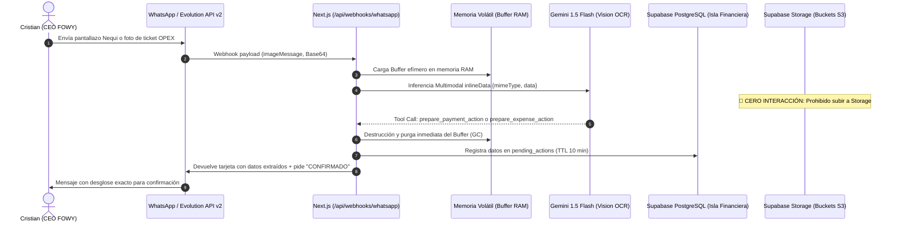

# ⚙️ FOWY iA FINANZAS & COPILOT — MOTOR BACKEND & BASE DE DATOS

> ⚠️ **REGLA DE ORO**: Solo se permite la creación o edición de líneas de código y la realización de copias de seguridad (Backups) en GitHub si, y solo si, Cristian (CEO de FOWY) lo solicita expresamente.

> **Documento Maestro de Base de Datos, Procedimientos RPC Atómicos, Seguridad y Escalabilidad**  
> **Autor:** Antigravity AI (Especialista en Arquitectura SaaS & Finanzas Tecnológicas)  
> **Destinatario:** Cristian (CEO de FOWY)  
> **Alineación:** [`Markdown/conceptos.md`](file:///c:/Users/cange/Documents/fowy/Markdown/conceptos.md), [`Markdown/Contabilidad/iA.UX-UI.md`](file:///c:/Users/cange/Documents/fowy/Markdown/Contabilidad/iA.UX-UI.md) e [`Markdown/Contabilidad/iA.Work.md`](file:///c:/Users/cange/Documents/fowy/Markdown/Contabilidad/iA.Work.md)  
> **Fecha:** 5 de Septiembre de 2026  
> **Versión:** 1.1 (Motor 100% Blindado con Seed de Negocios Existentes, Timezone Colombia y Cero Escritura en businesses)  

---

## 🗄️ 1. Filosofía de Arquitectura de Datos: La Isla Financiera

Para garantizar que el módulo de comensales (`/explorar`, mapas Leaflet y menús `/[slug]`) permanezca **100% intocado y protegido contra regresiones**, la arquitectura aplica el **Patrón de Entidad Satélite (*Satellite Domain Pattern*)**:

```mermaid
graph TD
    subgraph Dominio Madre (100% Virgen e Intocable)
        B[(businesses - Datos Públicos y GPS)]
        O[(orders - Pedidos Comensales)]
    end

    subgraph Isla Financiera FOWY (La IA opera AQUÍ)
        BS[(business_subscriptions - Satélite 1:1)]
        FA[(financial_accounts - Cajas Multibolsillo)]
        MP[(membership_payments - Recibos REC-XXXX)]
        OE[(operational_expenses - Egresos OPEX)]
        PC[(payment_commitments - Cartera y Acuerdos)]
        CT[(ceo_tasks - Agenda de Campo)]
        DFR[(daily_financial_reports - Cierre Inmutable)]
        AT[(account_transfers - Traspasos de Fondos)]
        PA[(pending_actions - TTL 10 min)]
        PWE[(processed_webhook_events - Idempotencia)]
    end

    B -.->|Solo Lectura| BS
    O -.->|Solo Lectura Analítica| BS
    IA[Agente Copilot / Webhooks] -->|Escribe Únicamente en| Isla Financiera
```

* **Regla Sagrada:** La tabla `businesses` **NO recibe columnas nuevas ni sentencias `UPDATE`**.
* La IA y los procedimientos contables escriben de forma exclusiva dentro de las 10 tablas de la **Isla Financiera**.

---

## 🧱 2. Esquema DDL Formal (PostgreSQL en Supabase)

### 2.1 Tabla Satélite de Suscripciones & Onboarding (`business_subscriptions`)
Aísla el ciclo de vida comercial, cortes y entregables sin alterar `businesses`:

```sql
CREATE TABLE IF NOT EXISTS business_subscriptions (
    business_id UUID PRIMARY KEY REFERENCES businesses(id) ON DELETE CASCADE,
    subscription_status VARCHAR(20) NOT NULL DEFAULT 'trial', -- 'trial', 'active', 'grace_period', 'suspended'
    trial_ends_at TIMESTAMPTZ DEFAULT (NOW() + INTERVAL '15 days'),
    next_billing_date TIMESTAMPTZ,
    monthly_fee NUMERIC(10,2) DEFAULT 50000.00,
    billing_notes TEXT,
    -- Entregables y Trabajos Operativos Dinámicos (Mochila Flexible JSONB)
    -- Permite guardar cualquier trabajo presente o futuro (fotos, volantes, pendón, stickers QR, reels, manteles, etc.)
    deliverables JSONB DEFAULT '{"fotos": "pending", "volantes": "none", "stickers_qr": "pending", "menu_ready": false}'::jsonb,
    -- Especificación Flexible del Plan y Módulos de Software (Libreta de Notas JSONB)
    -- Funciona como una nota editable sin rigidez: permite registrar qué plan/módulos tiene activos el negocio (standard, pro, premium, inventario, delivery, etc.) sin ALTER TABLE
    modules JSONB DEFAULT '{"standard": true, "pro": false, "premium": false, "inventario": false}'::jsonb,
    created_at TIMESTAMPTZ DEFAULT NOW(),
    updated_at TIMESTAMPTZ DEFAULT NOW()
);

-- 2.1.1 Inicialización / Backfill de Negocios Existentes (Cero Ceros en Producción)
-- Da de alta a todos los negocios existentes en 'trial' sin alterar la tabla businesses
INSERT INTO business_subscriptions (business_id, subscription_status, trial_ends_at, monthly_fee)
SELECT id, 'trial', (created_at + INTERVAL '15 days'), 50000.00
FROM businesses
ON CONFLICT (business_id) DO NOTHING;
```

### 2.2 Arqueo de Cuentas Financieras y Cajas (`financial_accounts`)
Gestiona los diferentes bolsillos de liquidez real en Colombia:

```sql
CREATE TABLE IF NOT EXISTS financial_accounts (
    id UUID PRIMARY KEY DEFAULT gen_random_uuid(),
    code VARCHAR(30) UNIQUE NOT NULL, -- 'nequi', 'daviplata', 'bancolombia', 'cash', 'other'
    name VARCHAR(50) NOT NULL,
    current_balance NUMERIC(12,2) DEFAULT 0.00,
    account_number VARCHAR(50),
    is_active BOOLEAN DEFAULT TRUE,
    updated_at TIMESTAMPTZ DEFAULT NOW()
);
```

### 2.3 Pagos de Membresías y Recibos Consecutivos (`membership_payments`)
Registra cada ingreso con consecutivo legal único y soporte para abonos parciales:

```sql
CREATE TABLE IF NOT EXISTS membership_payments (
    id UUID PRIMARY KEY DEFAULT gen_random_uuid(),
    receipt_number SERIAL UNIQUE, -- Consecutivo automático para comprobantes (ej: REC-001)
    business_id UUID REFERENCES businesses(id) ON DELETE CASCADE,
    account_id UUID REFERENCES financial_accounts(id),
    amount NUMERIC(10,2) NOT NULL CHECK (amount > 0),
    payment_method VARCHAR(30) NOT NULL, -- 'nequi', 'daviplata', 'bancolombia', 'cash'
    is_partial BOOLEAN DEFAULT FALSE,    -- Soporte para abonos parciales (ej: $25.000)
    commitment_id UUID,                  -- Enlace opcional con compromiso previo
    period_start TIMESTAMPTZ NOT NULL,
    period_end TIMESTAMPTZ NOT NULL,
    proof_url TEXT,
    notes TEXT,
    created_at TIMESTAMPTZ DEFAULT NOW(),
    registered_by UUID REFERENCES auth.users(id)
);
```

### 2.4 Egresos y Gastos Operativos (`operational_expenses`)
Registra el OPEX real de FOWY imputando a cuentas y locales:

```sql
CREATE TABLE IF NOT EXISTS operational_expenses (
    id UUID PRIMARY KEY DEFAULT gen_random_uuid(),
    account_id UUID REFERENCES financial_accounts(id) NOT NULL,
    category VARCHAR(40) NOT NULL, -- 'infrastructure', 'flyers_printing', 'photography', 'transport', 'marketing', 'other'
    amount NUMERIC(10,2) NOT NULL CHECK (amount > 0),
    description TEXT NOT NULL,
    related_business_id UUID REFERENCES businesses(id) ON DELETE SET NULL,
    receipt_proof_url TEXT,
    expense_date DATE DEFAULT CURRENT_DATE,
    created_at TIMESTAMPTZ DEFAULT NOW(),
    registered_by UUID REFERENCES auth.users(id)
);
```

### 2.5 Cartera y Compromisos Verbales de Pago (`payment_commitments`)
Memoria de acuerdos de pago pactados en persona o por chat:

```sql
CREATE TABLE IF NOT EXISTS payment_commitments (
    id UUID PRIMARY KEY DEFAULT gen_random_uuid(),
    business_id UUID REFERENCES businesses(id) ON DELETE CASCADE,
    agreed_amount NUMERIC(10,2) NOT NULL,
    agreed_date DATE NOT NULL,
    notes TEXT NOT NULL,
    status VARCHAR(20) DEFAULT 'pending', -- 'pending', 'fulfilled', 'renegotiated', 'broken'
    created_at TIMESTAMPTZ DEFAULT NOW(),
    registered_by UUID REFERENCES auth.users(id)
);
```

### 2.6 Agenda de Campo & Tareas del CEO (`ceo_tasks`)
Control de visitas presenciales, mandados de imprenta y recordatorios:

```sql
CREATE TABLE IF NOT EXISTS ceo_tasks (
    id UUID PRIMARY KEY DEFAULT gen_random_uuid(),
    task_type VARCHAR(30) NOT NULL, -- 'visita', 'impresion_volantes', 'fotos', 'reunion', 'cobro', 'otro'
    title TEXT NOT NULL,
    business_id UUID REFERENCES businesses(id) ON DELETE SET NULL,
    due_date DATE NOT NULL,
    due_time TIME,
    priority VARCHAR(10) DEFAULT 'media', -- 'alta', 'media', 'baja'
    status VARCHAR(20) DEFAULT 'pending', -- 'pending', 'completed', 'rescheduled', 'cancelled'
    notes TEXT,
    created_at TIMESTAMPTZ DEFAULT NOW(),
    registered_by UUID REFERENCES auth.users(id)
);
```

### 2.7 Cierre Diario y Libro Mayor Inmutable (`daily_financial_reports`)
Almacena el balance nocturno auditado automáticamente por el sistema:

```sql
CREATE TABLE IF NOT EXISTS daily_financial_reports (
    id UUID PRIMARY KEY DEFAULT gen_random_uuid(),
    report_date DATE NOT NULL UNIQUE DEFAULT CURRENT_DATE,
    total_active_businesses INT NOT NULL,
    businesses_in_trial INT NOT NULL,
    businesses_due_today INT NOT NULL,
    businesses_in_grace INT NOT NULL,
    businesses_suspended INT NOT NULL,
    daily_income NUMERIC(10,2) DEFAULT 0.00,
    daily_expenses NUMERIC(10,2) DEFAULT 0.00,
    daily_net NUMERIC(10,2) DEFAULT 0.00,
    month_to_date_income NUMERIC(10,2) DEFAULT 0.00,
    month_to_date_expenses NUMERIC(10,2) DEFAULT 0.00,
    month_to_date_net NUMERIC(10,2) DEFAULT 0.00,
    pending_receivables NUMERIC(10,2) DEFAULT 0.00,
    executive_summary TEXT NOT NULL,
    morning_briefing_text TEXT NOT NULL,
    tasks_scheduled_today JSONB DEFAULT '[]'::jsonb,
    commitments_due JSONB DEFAULT '[]'::jsonb,
    urgent_actions JSONB DEFAULT '[]'::jsonb,
    ai_cfo_recommendations TEXT,
    created_at TIMESTAMPTZ DEFAULT NOW()
);
```

### 2.8 Traspasos de Fondos entre Cuentas (`account_transfers`)
Movimiento de dinero entre bolsillos sin afectar el P&L:

```sql
CREATE TABLE IF NOT EXISTS account_transfers (
    id UUID PRIMARY KEY DEFAULT gen_random_uuid(),
    source_account_id UUID REFERENCES financial_accounts(id) NOT NULL,
    destination_account_id UUID REFERENCES financial_accounts(id) NOT NULL,
    amount NUMERIC(10,2) NOT NULL CHECK (amount > 0),
    fee NUMERIC(10,2) DEFAULT 0.00,
    notes TEXT,
    created_at TIMESTAMPTZ DEFAULT NOW(),
    registered_by UUID REFERENCES auth.users(id)
);
```

### 2.9 Acciones Pendientes con TTL de 10 Minutos (`pending_actions`)
Soporte de la confirmación en dos pasos (*Two-Step Confirmation*):

```sql
CREATE TABLE IF NOT EXISTS pending_actions (
    id UUID PRIMARY KEY DEFAULT gen_random_uuid(),
    channel VARCHAR(20) NOT NULL, -- 'whatsapp', 'web'
    action_type VARCHAR(50) NOT NULL, -- 'register_payment', 'register_expense', 'register_transfer', 'schedule_task'
    payload JSONB NOT NULL,
    status VARCHAR(20) DEFAULT 'pending', -- 'pending', 'executed', 'cancelled', 'expired', 'superseded'
    expires_at TIMESTAMPTZ NOT NULL DEFAULT (NOW() + INTERVAL '10 minutes'),
    created_at TIMESTAMPTZ DEFAULT NOW(),
    executed_at TIMESTAMPTZ,
    user_id UUID REFERENCES auth.users(id)
);

-- Índice Parcial de Alto Rendimiento (Búsqueda en <0.5ms en RAM para acciones activas)
CREATE INDEX IF NOT EXISTS idx_pending_actions_active 
ON pending_actions(channel, expires_at) 
WHERE status = 'pending';

### 2.10 Deduplicación e Idempotencia de Webhooks (`processed_webhook_events`)
Previene duplicación de transacciones ante reintentos de red.
-- Retención y purga automática: Registros > 7 días purgados automáticamente en el cron nocturno de las 11:59 PM.
CREATE TABLE IF NOT EXISTS processed_webhook_events (
    message_id VARCHAR(100) PRIMARY KEY,
    sender_phone VARCHAR(30) NOT NULL,
    event_type VARCHAR(30) NOT NULL,
    processed_at TIMESTAMPTZ DEFAULT NOW()
);
```

---

## ⚡ 3. Procedimientos Transaccionales Atómicos (ACID en 1 RTT)

### 3.1 `apply_confirmed_membership_payment`
Aplica el pago, suma en caja, actualiza la fecha en `business_subscriptions` y crea cartera si fue abono parcial:

```sql
CREATE OR REPLACE FUNCTION apply_confirmed_membership_payment(
    p_business_id UUID,
    p_account_id UUID,
    p_amount NUMERIC,
    p_payment_method VARCHAR,
    p_extension_days INT DEFAULT 30,
    p_notes TEXT DEFAULT NULL,
    p_is_partial BOOLEAN DEFAULT FALSE,
    p_commitment_id UUID DEFAULT NULL,
    p_remaining_amount NUMERIC DEFAULT 0.00,
    p_remaining_due_date DATE DEFAULT NULL
)
RETURNS JSONB
LANGUAGE plpgsql
SECURITY DEFINER
AS $$
DECLARE
    v_receipt_number INT;
    v_new_billing_date TIMESTAMPTZ;
    v_business_name TEXT;
    v_new_commitment_id UUID := NULL;
BEGIN
    SELECT name INTO v_business_name FROM businesses WHERE id = p_business_id;
    IF NOT FOUND THEN
        RAISE EXCEPTION 'Negocio no encontrado';
    END IF;

    -- 1. Insertar pago
    INSERT INTO membership_payments (
        business_id, account_id, amount, payment_method, 
        period_start, period_end, notes, is_partial, commitment_id
    ) VALUES (
        p_business_id, p_account_id, p_amount, p_payment_method,
        NOW(), NOW() + (p_extension_days || ' days')::INTERVAL, 
        p_notes, p_is_partial, p_commitment_id
    ) RETURNING receipt_number INTO v_receipt_number;

    -- 2. Incrementar saldo en cuenta
    UPDATE financial_accounts
    SET current_balance = current_balance + p_amount, updated_at = NOW()
    WHERE id = p_account_id;

    -- 3. Upsert en tabla satélite business_subscriptions (businesses queda intacta)
    INSERT INTO business_subscriptions (business_id, subscription_status, next_billing_date)
    VALUES (
        p_business_id, 
        'active', 
        NOW() + (p_extension_days || ' days')::INTERVAL
    )
    ON CONFLICT (business_id) DO UPDATE
    SET subscription_status = 'active',
        next_billing_date = CASE 
            WHEN business_subscriptions.next_billing_date IS NULL OR business_subscriptions.next_billing_date < NOW() THEN NOW() + (p_extension_days || ' days')::INTERVAL
            ELSE business_subscriptions.next_billing_date + (p_extension_days || ' days')::INTERVAL
        END,
        updated_at = NOW()
    RETURNING next_billing_date INTO v_new_billing_date;

    -- 4. Cerrar compromiso verbal si existía
    IF p_commitment_id IS NOT NULL THEN
        UPDATE payment_commitments SET status = 'fulfilled' WHERE id = p_commitment_id;
    END IF;

    -- 5. Crear cartera si fue abono parcial con saldo restante
    IF p_is_partial AND p_remaining_amount > 0 THEN
        INSERT INTO payment_commitments (
            business_id, agreed_amount, agreed_date, notes, status
        ) VALUES (
            p_business_id, 
            p_remaining_amount, 
            COALESCE(p_remaining_due_date, CURRENT_DATE + 7), 
            'Saldo pendiente de abono parcial (Recibo REC-' || LPAD(v_receipt_number::TEXT, 4, '0') || ')',
            'pending'
        ) RETURNING id INTO v_new_commitment_id;
    END IF;

    RETURN jsonb_build_object(
        'success', true,
        'receipt_number', v_receipt_number,
        'receipt_code', 'REC-' || LPAD(v_receipt_number::TEXT, 4, '0'),
        'business_name', v_business_name,
        'amount', p_amount,
        'is_partial', p_is_partial,
        'remaining_amount', p_remaining_amount,
        'remaining_commitment_id', v_new_commitment_id,
        'next_billing_date', v_new_billing_date
    );
END;
$$;
```

### 3.2 `apply_confirmed_expense`
Aplica el egreso OPEX y descuenta atómicamente el saldo en la cuenta de origen:

```sql
CREATE OR REPLACE FUNCTION apply_confirmed_expense(
    p_account_id UUID,
    p_category VARCHAR,
    p_amount NUMERIC,
    p_description TEXT,
    p_related_business_id UUID DEFAULT NULL,
    p_expense_date DATE DEFAULT CURRENT_DATE
)
RETURNS JSONB
LANGUAGE plpgsql
SECURITY DEFINER
AS $$
DECLARE
    v_expense_id UUID;
    v_account_name TEXT;
    v_new_balance NUMERIC;
BEGIN
    SELECT name INTO v_account_name FROM financial_accounts WHERE id = p_account_id;
    IF NOT FOUND THEN
        RAISE EXCEPTION 'Cuenta financiera no encontrada';
    END IF;

    -- 1. Insertar egreso operativo
    INSERT INTO operational_expenses (
        account_id, category, amount, description, 
        related_business_id, expense_date
    ) VALUES (
        p_account_id, p_category, p_amount, p_description, 
        p_related_business_id, p_expense_date
    ) RETURNING id INTO v_expense_id;

    -- 2. Descontar saldo en cuenta financiera
    UPDATE financial_accounts
    SET current_balance = current_balance - p_amount, updated_at = NOW()
    WHERE id = p_account_id
    RETURNING current_balance INTO v_new_balance;

    RETURN jsonb_build_object(
        'success', true,
        'expense_id', v_expense_id,
        'account_name', v_account_name,
        'amount', p_amount,
        'new_balance', v_new_balance
    );
END;
$$;
```

### 3.3 `apply_account_transfer`
Traspasa fondos entre cuentas descontando comisiones bancarias si existen:

```sql
CREATE OR REPLACE FUNCTION apply_account_transfer(
    p_source_account_id UUID,
    p_destination_account_id UUID,
    p_amount NUMERIC,
    p_fee NUMERIC DEFAULT 0.00,
    p_notes TEXT DEFAULT NULL
)
RETURNS JSONB
LANGUAGE plpgsql
SECURITY DEFINER
AS $$
BEGIN
    UPDATE financial_accounts 
    SET current_balance = current_balance - (p_amount + p_fee), updated_at = NOW()
    WHERE id = p_source_account_id;

    UPDATE financial_accounts 
    SET current_balance = current_balance + p_amount, updated_at = NOW()
    WHERE id = p_destination_account_id;

    INSERT INTO account_transfers (source_account_id, destination_account_id, amount, fee, notes)
    VALUES (p_source_account_id, p_destination_account_id, p_amount, p_fee, p_notes);

    IF p_fee > 0 THEN
        INSERT INTO operational_expenses (account_id, category, amount, description, expense_date)
        VALUES (p_source_account_id, 'infrastructure', p_fee, 'Comisión bancaria de traspaso', CURRENT_DATE);
    END IF;

    RETURN jsonb_build_object('success', true, 'amount', p_amount, 'fee', p_fee);
END;
$$;
```

### 3.4 `get_business_dossier`
Consulta el expediente 360° en `<10 ms` uniendo `businesses` con `business_subscriptions` y calculando al vuelo las tendencias de crecimiento porcentual (% DoD, WoW, MoM) sin agregar columnas en `businesses`:

```sql
CREATE OR REPLACE FUNCTION get_business_dossier(
    p_business_identifier TEXT
)
RETURNS JSONB
LANGUAGE plpgsql
SECURITY DEFINER
AS $$
DECLARE
    v_biz RECORD;
    v_metrics JSONB;
    v_growth JSONB;
    v_commitments JSONB;
    v_tasks JSONB;
    -- Variables para cálculo porcentual dinámico
    v_orders_7d INT := 0;
    v_orders_prev_7d INT := 0;
    v_orders_30d INT := 0;
    v_orders_prev_30d INT := 0;
    v_visits_7d INT := 0;
    v_visits_prev_7d INT := 0;
    v_visits_30d INT := 0;
    v_visits_prev_30d INT := 0;
    v_orders_wow_pct NUMERIC := 0.0;
    v_orders_mom_pct NUMERIC := 0.0;
    v_visits_wow_pct NUMERIC := 0.0;
    v_visits_mom_pct NUMERIC := 0.0;
BEGIN
    SELECT b.id, b.name, b.slug, 
           COALESCE(bs.subscription_status, 'trial') AS subscription_status, 
           bs.next_billing_date, 
           COALESCE(bs.monthly_fee, 50000.00) AS monthly_fee,
           COALESCE(bs.deliverables, '{}'::jsonb) AS deliverables,
           COALESCE(bs.modules, '{"standard": true, "pro": false, "premium": false, "inventario": false}'::jsonb) AS modules
    INTO v_biz
    FROM businesses b
    LEFT JOIN business_subscriptions bs ON bs.business_id = b.id
    WHERE b.id::TEXT = p_business_identifier 
       OR b.slug = p_business_identifier
       OR b.name ILIKE '%' || p_business_identifier || '%'
    ORDER BY (b.name ILIKE p_business_identifier || '%') DESC
    LIMIT 1;

    IF NOT FOUND THEN
        RETURN jsonb_build_object('error', 'Negocio no encontrado');
    END IF;

    -- Métricas consolidadas de los últimos 30 días
    SELECT jsonb_build_object(
        'total_orders_last_30d', COUNT(*),
        'estimated_gross_sales', COALESCE(SUM(total_amount), 0),
        'average_ticket', CASE WHEN COUNT(*) > 0 THEN ROUND(COALESCE(SUM(total_amount), 0) / COUNT(*), 2) ELSE 0 END,
        'fowy_cost_per_order', CASE WHEN COUNT(*) > 0 THEN ROUND(COALESCE(v_biz.monthly_fee, 50000.00) / COUNT(*), 2) ELSE 0 END
    ) INTO v_metrics
    FROM orders
    WHERE business_id = v_biz.id AND created_at >= NOW() - INTERVAL '30 days';

    -- 2. Cálculo dinámico de Crecimiento Porcentual (Sin alterar businesses)
    -- Pedidos: 7 días actuales vs 7 días anteriores
    SELECT COUNT(*) INTO v_orders_7d FROM orders WHERE business_id = v_biz.id AND created_at >= NOW() - INTERVAL '7 days';
    SELECT COUNT(*) INTO v_orders_prev_7d FROM orders WHERE business_id = v_biz.id AND created_at >= NOW() - INTERVAL '14 days' AND created_at < NOW() - INTERVAL '7 days';
    IF v_orders_prev_7d > 0 THEN
        v_orders_wow_pct := ROUND(((v_orders_7d - v_orders_prev_7d)::NUMERIC / v_orders_prev_7d) * 100, 1);
    ELSIF v_orders_7d > 0 THEN
        v_orders_wow_pct := 100.0;
    END IF;

    -- Pedidos: 30 días actuales vs 30 días anteriores
    SELECT COUNT(*) INTO v_orders_30d FROM orders WHERE business_id = v_biz.id AND created_at >= NOW() - INTERVAL '30 days';
    SELECT COUNT(*) INTO v_orders_prev_30d FROM orders WHERE business_id = v_biz.id AND created_at >= NOW() - INTERVAL '60 days' AND created_at < NOW() - INTERVAL '30 days';
    IF v_orders_prev_30d > 0 THEN
        v_orders_mom_pct := ROUND(((v_orders_30d - v_orders_prev_30d)::NUMERIC / v_orders_prev_30d) * 100, 1);
    ELSIF v_orders_30d > 0 THEN
        v_orders_mom_pct := 100.0;
    END IF;

    -- Visitas al menú digital: 7 días actuales vs 7 días anteriores
    SELECT COUNT(*) INTO v_visits_7d FROM analytics_visits WHERE business_id = v_biz.id AND created_at >= NOW() - INTERVAL '7 days';
    SELECT COUNT(*) INTO v_visits_prev_7d FROM analytics_visits WHERE business_id = v_biz.id AND created_at >= NOW() - INTERVAL '14 days' AND created_at < NOW() - INTERVAL '7 days';
    IF v_visits_prev_7d > 0 THEN
        v_visits_wow_pct := ROUND(((v_visits_7d - v_visits_prev_7d)::NUMERIC / v_visits_prev_7d) * 100, 1);
    ELSIF v_visits_7d > 0 THEN
        v_visits_wow_pct := 100.0;
    END IF;

    -- Visitas al menú digital: 30 días actuales vs 30 días anteriores
    SELECT COUNT(*) INTO v_visits_30d FROM analytics_visits WHERE business_id = v_biz.id AND created_at >= NOW() - INTERVAL '30 days';
    SELECT COUNT(*) INTO v_visits_prev_30d FROM analytics_visits WHERE business_id = v_biz.id AND created_at >= NOW() - INTERVAL '60 days' AND created_at < NOW() - INTERVAL '30 days';
    IF v_visits_prev_30d > 0 THEN
        v_visits_mom_pct := ROUND(((v_visits_30d - v_visits_prev_30d)::NUMERIC / v_visits_prev_30d) * 100, 1);
    ELSIF v_visits_30d > 0 THEN
        v_visits_mom_pct := 100.0;
    END IF;

    v_growth := jsonb_build_object(
        'orders_wow_pct', v_orders_wow_pct,
        'orders_mom_pct', v_orders_mom_pct,
        'visits_wow_pct', v_visits_wow_pct,
        'visits_mom_pct', v_visits_mom_pct,
        'orders_current_7d', v_orders_7d,
        'visits_current_7d', v_visits_7d
    );

    SELECT jsonb_agg(jsonb_build_object(
        'id', id, 'agreed_amount', agreed_amount, 'agreed_date', agreed_date, 'notes', notes, 'status', status
    )) INTO v_commitments
    FROM payment_commitments
    WHERE business_id = v_biz.id AND status = 'pending';

    SELECT jsonb_agg(jsonb_build_object(
        'id', id, 'title', title, 'task_type', task_type, 'due_date', due_date, 'due_time', due_time, 'status', status
    )) INTO v_tasks
    FROM ceo_tasks
    WHERE business_id = v_biz.id AND status = 'pending';

    RETURN jsonb_build_object(
        'business', jsonb_build_object(
            'id', v_biz.id,
            'name', v_biz.name,
            'slug', v_biz.slug,
            'subscription_status', v_biz.subscription_status,
            'next_billing_date', v_biz.next_billing_date,
            'monthly_fee', v_biz.monthly_fee,
            'deliverables', v_biz.deliverables,
            'modules', v_biz.modules
        ),
        'recent_metrics', v_metrics,
        'growth_metrics', v_growth,
        'pending_commitments', COALESCE(v_commitments, '[]'::jsonb),
        'agenda_tasks', COALESCE(v_tasks, '[]'::jsonb)
    );
END;
$$;
```

### 3.5 `get_admin_finance_summary`
Calcula el P&L completo, cajas, tareas, semáforos y **métricas de salud financiera (CPI, DSO, Runway y Margen Operativo)** en **< 4 KB y < 15 ms**:

```sql
CREATE OR REPLACE FUNCTION get_admin_finance_summary()
RETURNS JSONB
LANGUAGE plpgsql
SECURITY DEFINER
AS $$
DECLARE
    v_income NUMERIC := 0.00;
    v_expenses NUMERIC := 0.00;
    v_paid_count INT := 0;
    v_receivables NUMERIC := 0.00;
    v_total_liquidity NUMERIC := 0.00;
    v_avg_onboarding_cost NUMERIC := 0.00;
    v_cpi NUMERIC := 1.0;
    v_dso NUMERIC := 0.0;
    v_runway NUMERIC := 0.0;
    v_margin_pct NUMERIC := 0.0;
    v_tithing NUMERIC := 0.00;
    v_metrics JSONB;
    v_health_kpis JSONB;
    v_accounts JSONB;
    v_today_tasks JSONB;
    v_counts JSONB;
BEGIN
    -- 1. Ingresos y recaudos del mes en curso (Hora Colombia)
    SELECT COALESCE(SUM(amount), 0), COUNT(*)
    INTO v_income, v_paid_count
    FROM membership_payments 
    WHERE period_start >= date_trunc('month', NOW() AT TIME ZONE 'America/Bogota');

    -- 2. Egresos y gastos operativos (OPEX) del mes
    SELECT COALESCE(SUM(amount), 0)
    INTO v_expenses
    FROM operational_expenses
    WHERE expense_date >= (date_trunc('month', NOW() AT TIME ZONE 'America/Bogota'))::DATE;

    -- 3. Cartera pendiente (compromisos verbales activos)
    SELECT COALESCE(SUM(agreed_amount), 0)
    INTO v_receivables
    FROM payment_commitments
    WHERE status = 'pending';

    -- 4. Liquidez total disponible en todos los bolsillos activos
    SELECT COALESCE(SUM(current_balance), 0)
    INTO v_total_liquidity
    FROM financial_accounts 
    WHERE is_active = TRUE;

    -- 5. Cálculo de Indicadores de Salud Financiera & Eficiencia (KPI / CPI):
    -- 5.1 Margen Operativo Neto (%)
    IF v_income > 0 THEN
        v_margin_pct := ROUND(((v_income - v_expenses) / v_income) * 100, 1);
    ELSE
        v_margin_pct := 0.0;
    END IF;

    -- 5.2 Diezmo (10% de la Utilidad Neta Real tras descontar todos los gastos OPEX posibles)
    IF (v_income - v_expenses) > 0 THEN
        v_tithing := ROUND((v_income - v_expenses) * 0.10, 2);
    ELSE
        v_tithing := 0.00;
    END IF;

    -- 5.3 CPI Onboarding (Cost Performance Index):
    -- Presupuesto base de activación ($35.000 COP) vs Costo real promedio en volantes y fotos
    SELECT COALESCE(AVG(amount), 35000.00)
    INTO v_avg_onboarding_cost
    FROM operational_expenses
    WHERE category IN ('flyers_printing', 'photography')
      AND expense_date >= NOW() - INTERVAL '60 days';

    IF v_avg_onboarding_cost > 0 THEN
        v_cpi := ROUND(35000.00 / v_avg_onboarding_cost, 2);
    ELSE
        v_cpi := 1.0;
    END IF;

    -- 5.4 DSO Cartera (Days Sales Outstanding):
    -- Días promedio de cobro en calle: (Cartera / (Ingreso mensual / 30 días))
    IF v_income > 0 THEN
        v_dso := ROUND(v_receivables / (v_income / 30.0), 1);
    ELSE
        v_dso := 0.0;
    END IF;

    -- 5.5 Runway de Caja (Meses):
    -- Cobertura de supervivencia con costo fijo mensual estimado ($120.000 COP ~ Supabase Pro $25 USD)
    v_runway := ROUND(v_total_liquidity / NULLIF(120000.00, 0), 1);

    v_metrics := jsonb_build_object(
        'month_income', v_income,
        'month_expenses', v_expenses,
        'net_profit', v_income - v_expenses,
        'tithing', v_tithing,
        'pending_receivables', v_receivables,
        'total_paid_count', v_paid_count,
        'operating_margin_pct', v_margin_pct
    );

    v_health_kpis := jsonb_build_object(
        'cpi_onboarding', v_cpi,
        'dso_days', v_dso,
        'runway_months', v_runway,
        'operating_margin_pct', v_margin_pct
    );

    -- Conteo de negocios por semáforo 100% resiliente (combina businesses con satélite)
    SELECT jsonb_build_object(
        'active', COUNT(*) FILTER (WHERE COALESCE(bs.subscription_status, 'trial') = 'active'),
        'trial', COUNT(*) FILTER (WHERE COALESCE(bs.subscription_status, 'trial') = 'trial'),
        'grace_period', COUNT(*) FILTER (WHERE COALESCE(bs.subscription_status, 'trial') = 'grace_period'),
        'suspended', COUNT(*) FILTER (WHERE COALESCE(bs.subscription_status, 'trial') = 'suspended'),
        'total', COUNT(b.id)
    ) INTO v_counts 
    FROM businesses b
    LEFT JOIN business_subscriptions bs ON bs.business_id = b.id;

    SELECT jsonb_agg(jsonb_build_object(
        'id', id, 'code', code, 'name', name, 'current_balance', current_balance
    )) INTO v_accounts FROM financial_accounts WHERE is_active = TRUE;

    SELECT jsonb_agg(jsonb_build_object(
        'id', id, 'title', title, 'task_type', task_type, 'due_time', due_time, 'status', status, 'business_id', business_id
    )) INTO v_today_tasks FROM ceo_tasks WHERE due_date = CURRENT_DATE AND status = 'pending';

    RETURN jsonb_build_object(
        'metrics', v_metrics,
        'health_kpis', v_health_kpis,
        'counts', v_counts,
        'accounts', COALESCE(v_accounts, '[]'::jsonb),
        'today_tasks', COALESCE(v_today_tasks, '[]'::jsonb)
    );
END;
$$;
```

### 3.6 `get_admin_businesses_billing_page`
Paginación server-side (30 en 30) con filtros y búsqueda GIN Trigram:

```sql
CREATE OR REPLACE FUNCTION get_admin_businesses_billing_page(
    p_status VARCHAR DEFAULT 'all',
    p_search TEXT DEFAULT '',
    p_limit INT DEFAULT 30,
    p_offset INT DEFAULT 0
)
RETURNS JSONB
LANGUAGE plpgsql
SECURITY DEFINER
AS $$
DECLARE
    v_rows JSONB;
    v_total_filtered INT;
BEGIN
    SELECT COUNT(*) INTO v_total_filtered
    FROM businesses b
    LEFT JOIN business_subscriptions bs ON bs.business_id = b.id
    WHERE (p_status = 'all' OR COALESCE(bs.subscription_status, 'trial') = p_status)
      AND (p_search = '' OR b.name ILIKE '%' || p_search || '%');

    SELECT jsonb_agg(jsonb_build_object(
        'id', id,
        'name', name,
        'subscription_status', subscription_status,
        'trial_ends_at', trial_ends_at,
        'next_billing_date', next_billing_date,
        'monthly_fee', monthly_fee,
        'deliverables', deliverables,
        'modules', modules
    )) INTO v_rows
    FROM (
        SELECT b.id, b.name, 
               COALESCE(bs.subscription_status, 'trial') AS subscription_status, 
               bs.trial_ends_at, 
               bs.next_billing_date, 
               COALESCE(bs.monthly_fee, 50000.00) AS monthly_fee, 
               COALESCE(bs.deliverables, '{}'::jsonb) AS deliverables,
               COALESCE(bs.modules, '{"standard": true, "pro": false, "premium": false, "inventario": false}'::jsonb) AS modules
        FROM businesses b
        LEFT JOIN business_subscriptions bs ON bs.business_id = b.id
        WHERE (p_status = 'all' OR COALESCE(bs.subscription_status, 'trial') = p_status)
          AND (p_search = '' OR b.name ILIKE '%' || p_search || '%')
        ORDER BY 
            CASE WHEN COALESCE(bs.subscription_status, 'trial') = 'grace_period' THEN 1
                 WHEN COALESCE(bs.subscription_status, 'trial') = 'trial' THEN 2
                 ELSE 3 END,
            bs.next_billing_date ASC NULLS LAST
        LIMIT p_limit OFFSET p_offset
    ) sub;

    RETURN jsonb_build_object(
        'data', COALESCE(v_rows, '[]'::jsonb),
        'total', v_total_filtered,
        'limit', p_limit,
        'offset', p_offset
    );
END;
$$;
```

### 3.7 `get_network_growth_summary`
**Única Fuente de la Verdad (*Single Source of Truth*) para Crecimiento de la Red FOWY** (consumido por el Dashboard, Finanzas y el Copilot en `<10 ms`):  
Calcula directamente en PostgreSQL las variaciones porcentuales (% MoM, WoW, DoD) de afiliaciones de negocios y tráfico comensal sin escaneos masivos en el cliente:

```sql
CREATE OR REPLACE FUNCTION get_network_growth_summary()
RETURNS JSONB
LANGUAGE plpgsql
SECURITY DEFINER
AS $$
DECLARE
    v_total_businesses INT := 0;
    v_biz_this_month INT := 0;
    v_biz_prev_month INT := 0;
    v_biz_mom_pct NUMERIC := 0.0;
    v_visits_this_month INT := 0;
    v_visits_prev_month INT := 0;
    v_visits_this_week INT := 0;
    v_visits_prev_week INT := 0;
    v_visits_mom_pct NUMERIC := 0.0;
    v_visits_wow_pct NUMERIC := 0.0;
    v_orders_this_month INT := 0;
    v_orders_prev_month INT := 0;
    v_orders_mom_pct NUMERIC := 0.0;
BEGIN
    SELECT COUNT(*) INTO v_total_businesses FROM businesses;

    -- Afiliaciones: Este mes vs mes pasado (Tasa de Afiliación)
    SELECT COUNT(*) INTO v_biz_this_month FROM businesses 
    WHERE created_at >= date_trunc('month', NOW() AT TIME ZONE 'America/Bogota');

    SELECT COUNT(*) INTO v_biz_prev_month FROM businesses 
    WHERE created_at >= (date_trunc('month', NOW() AT TIME ZONE 'America/Bogota') - INTERVAL '1 month')
      AND created_at < date_trunc('month', NOW() AT TIME ZONE 'America/Bogota');

    IF v_biz_prev_month > 0 THEN
        v_biz_mom_pct := ROUND(((v_biz_this_month - v_biz_prev_month)::NUMERIC / v_biz_prev_month) * 100, 1);
    ELSIF v_biz_this_month > 0 THEN
        v_biz_mom_pct := 100.0;
    END IF;

    -- Visitas de comensales: Este mes vs mes pasado (Curva Macro Bezier)
    SELECT COUNT(*) INTO v_visits_this_month FROM analytics_visits 
    WHERE created_at >= date_trunc('month', NOW() AT TIME ZONE 'America/Bogota');

    SELECT COUNT(*) INTO v_visits_prev_month FROM analytics_visits 
    WHERE created_at >= (date_trunc('month', NOW() AT TIME ZONE 'America/Bogota') - INTERVAL '1 month')
      AND created_at < date_trunc('month', NOW() AT TIME ZONE 'America/Bogota');

    IF v_visits_prev_month > 0 THEN
        v_visits_mom_pct := ROUND(((v_visits_this_month - v_visits_prev_month)::NUMERIC / v_visits_prev_month) * 100, 1);
    ELSIF v_visits_this_month > 0 THEN
        v_visits_mom_pct := 100.0;
    END IF;

    -- Visitas: Esta semana vs semana anterior
    SELECT COUNT(*) INTO v_visits_this_week FROM analytics_visits 
    WHERE created_at >= NOW() - INTERVAL '7 days';

    SELECT COUNT(*) INTO v_visits_prev_week FROM analytics_visits 
    WHERE created_at >= NOW() - INTERVAL '14 days' AND created_at < NOW() - INTERVAL '7 days';

    IF v_visits_prev_week > 0 THEN
        v_visits_wow_pct := ROUND(((v_visits_this_week - v_visits_prev_week)::NUMERIC / v_visits_prev_week) * 100, 1);
    ELSIF v_visits_this_week > 0 THEN
        v_visits_wow_pct := 100.0;
    END IF;

    -- Pedidos / Conversión: Este mes vs mes pasado
    SELECT COUNT(*) INTO v_orders_this_month FROM orders 
    WHERE created_at >= date_trunc('month', NOW() AT TIME ZONE 'America/Bogota');

    SELECT COUNT(*) INTO v_orders_prev_month FROM orders 
    WHERE created_at >= (date_trunc('month', NOW() AT TIME ZONE 'America/Bogota') - INTERVAL '1 month')
      AND created_at < date_trunc('month', NOW() AT TIME ZONE 'America/Bogota');

    IF v_orders_prev_month > 0 THEN
        v_orders_mom_pct := ROUND(((v_orders_this_month - v_orders_prev_month)::NUMERIC / v_orders_prev_month) * 100, 1);
    ELSIF v_orders_this_month > 0 THEN
        v_orders_mom_pct := 100.0;
    END IF;

    RETURN jsonb_build_object(
        'total_businesses', v_total_businesses,
        'affiliations', jsonb_build_object(
            'this_month', v_biz_this_month,
            'prev_month', v_biz_prev_month,
            'growth_mom_pct', v_biz_mom_pct
        ),
        'visits', jsonb_build_object(
            'this_month', v_visits_this_month,
            'prev_month', v_visits_prev_month,
            'growth_mom_pct', v_visits_mom_pct,
            'growth_wow_pct', v_visits_wow_pct
        ),
        'orders_conversion', jsonb_build_object(
            'this_month', v_orders_this_month,
            'prev_month', v_orders_prev_month,
            'growth_mom_pct', v_orders_mom_pct
        )
    );
END;
$$;
```

---

## 🚀 4. Índices de Alto Rendimiento (Escalabilidad 10.000+ Negocios)

```sql
-- 1. Búsqueda instantánea de nombres con Trigram GIN (<5ms en 100k registros)
CREATE EXTENSION IF NOT EXISTS pg_trgm;
CREATE INDEX IF NOT EXISTS idx_businesses_name_trgm 
ON businesses USING gin (name gin_trgm_ops);

-- 2. Semáforos y cortes en la tabla satélite
CREATE INDEX IF NOT EXISTS idx_business_subscriptions_status_date 
ON business_subscriptions(subscription_status, next_billing_date ASC NULLS LAST);

-- 3. Histórico de cobros por mes
CREATE INDEX IF NOT EXISTS idx_membership_payments_period_lookup 
ON membership_payments(period_start DESC, business_id);

-- 4. Gastos OPEX por fecha descendente
CREATE INDEX IF NOT EXISTS idx_operational_expenses_date 
ON operational_expenses(expense_date DESC);

-- 5. Agenda del CEO por fecha y estado
CREATE INDEX IF NOT EXISTS idx_ceo_tasks_due_status 
ON ceo_tasks(due_date, status);

-- 6. Cola efímera de confirmación de 2 pasos (<0.5ms mediante Índice Parcial en RAM)
CREATE INDEX IF NOT EXISTS idx_pending_actions_active 
ON pending_actions(channel, expires_at) 
WHERE status = 'pending';

-- 7. Traspasos entre cuentas
CREATE INDEX IF NOT EXISTS idx_account_transfers_created 
ON account_transfers(created_at DESC);
```

---

## 🔒 5. Seguridad RLS y Permisos de Ejecución

```sql
-- Habilitar RLS en toda la Isla Financiera
ALTER TABLE business_subscriptions ENABLE ROW LEVEL SECURITY;
ALTER TABLE financial_accounts ENABLE ROW LEVEL SECURITY;
ALTER TABLE membership_payments ENABLE ROW LEVEL SECURITY;
ALTER TABLE operational_expenses ENABLE ROW LEVEL SECURITY;
ALTER TABLE payment_commitments ENABLE ROW LEVEL SECURITY;
ALTER TABLE ceo_tasks ENABLE ROW LEVEL SECURITY;
ALTER TABLE daily_financial_reports ENABLE ROW LEVEL SECURITY;
ALTER TABLE account_transfers ENABLE ROW LEVEL SECURITY;
ALTER TABLE pending_actions ENABLE ROW LEVEL SECURITY;
ALTER TABLE processed_webhook_events ENABLE ROW LEVEL SECURITY;

-- Política de Aislamiento para Administradores
DO $$
DECLARE
    tbl text;
    tables text[] := ARRAY[
        'business_subscriptions', 'financial_accounts', 'membership_payments', 
        'operational_expenses', 'payment_commitments', 'ceo_tasks', 
        'daily_financial_reports', 'account_transfers', 'pending_actions', 
        'processed_webhook_events'
    ];
BEGIN
    FOREACH tbl IN ARRAY tables LOOP
        EXECUTE format('
            DROP POLICY IF EXISTS admin_finance_isolation_policy ON %I;
            CREATE POLICY admin_finance_isolation_policy ON %I
            FOR ALL TO authenticated
            USING ((auth.jwt() ->> ''role'') = ''admin'')
            WITH CHECK ((auth.jwt() ->> ''role'') = ''admin'');
        ', tbl, tbl);
    END LOOP;
END;
$$;

-- Blindaje de Funciones RPC
REVOKE EXECUTE ON FUNCTION apply_confirmed_membership_payment FROM public;
GRANT EXECUTE ON FUNCTION apply_confirmed_membership_payment TO authenticated, service_role;

REVOKE EXECUTE ON FUNCTION apply_account_transfer FROM public;
GRANT EXECUTE ON FUNCTION apply_account_transfer TO authenticated, service_role;

REVOKE EXECUTE ON FUNCTION apply_confirmed_expense FROM public;
GRANT EXECUTE ON FUNCTION apply_confirmed_expense TO authenticated, service_role;

REVOKE EXECUTE ON FUNCTION get_business_dossier FROM public;
GRANT EXECUTE ON FUNCTION get_business_dossier TO authenticated, service_role;

REVOKE EXECUTE ON FUNCTION get_admin_finance_summary FROM public;
GRANT EXECUTE ON FUNCTION get_admin_finance_summary TO authenticated, service_role;

REVOKE EXECUTE ON FUNCTION get_admin_businesses_billing_page FROM public;
GRANT EXECUTE ON FUNCTION get_admin_businesses_billing_page TO authenticated, service_role;

REVOKE EXECUTE ON FUNCTION get_network_growth_summary FROM public;
GRANT EXECUTE ON FUNCTION get_network_growth_summary TO authenticated, service_role;

-- Permisos sobre Secuencia de Consecutivo de Recibos (SERIAL REC-XXXX)
GRANT USAGE, SELECT ON SEQUENCE membership_payments_receipt_number_seq TO authenticated, service_role;

-- Revocación Físico-SQL de DELETE (Criterio de la Llave Sin Borrado)
-- La base de datos rechaza de raíz cualquier intento de borrado sobre la Isla Financiera
-- NOTA TÉCNICA: Las tablas efímeras 'pending_actions' (por expiración de TTL de 10 min) y 
-- 'processed_webhook_events' (por purga nocturna automática de eventos > 7 días) se excluyen 
-- deliberadamente de esta restricción para permitir las labores de limpieza del sistema.
DO $$
DECLARE
    tbl text;
    tables text[] := ARRAY[
        'business_subscriptions', 'financial_accounts', 'membership_payments', 
        'operational_expenses', 'payment_commitments', 'ceo_tasks', 
        'daily_financial_reports', 'account_transfers'
    ];
BEGIN
    FOREACH tbl IN ARRAY tables LOOP
        EXECUTE format('REVOKE DELETE ON %I FROM authenticated, anon, public;', tbl);
    END LOOP;
END;
$$;
```

### 5.1 Suite de Pruebas de Verificación Técnica (DoD SQL - 7 RPCs)
Para certificar la correcta instalación de la Fase 1 en Supabase SQL Editor:
1. **Resumen Financiero:** `SELECT get_admin_finance_summary();` (Valida P&L, Diezmo (10% de utilidad neta), cuentas y semáforos en <20 ms).
2. **Paginación Server-Side:** `SELECT get_admin_businesses_billing_page('all', '', 10, 0);` (Valida paginación y Trigram GIN en <15 ms).
3. **Expediente 360°:** `SELECT get_business_dossier('fowy-lab');` (Valida unión satélite, entregables y métricas de pedidos en <10 ms).
4. **Pago Transaccional:** `SELECT apply_confirmed_membership_payment(p_business_id := (SELECT id FROM businesses WHERE slug = 'fowy-lab'), p_account_id := (SELECT id FROM financial_accounts WHERE code = 'nequi'), p_amount := 50000, p_payment_method := 'nequi');` (Valida generación de REC-XXXX, suma a Nequi y actualización de fecha).
5. **Gasto OPEX:** `SELECT apply_confirmed_expense(p_account_id := (SELECT id FROM financial_accounts WHERE code = 'nequi'), p_category := 'infrastructure', p_amount := 10000, p_description := 'Prueba OPEX');` (Valida inserción y descuento en caja).
6. **Traspaso de Fondos:** `SELECT apply_account_transfer(p_source_account_id := (SELECT id FROM financial_accounts WHERE code = 'nequi'), p_destination_account_id := (SELECT id FROM financial_accounts WHERE code = 'daviplata'), p_amount := 5000);` (Valida movimiento entre bolsillos sin afectar P&L).
7. **Crecimiento Macroeconómico Red FOWY:** `SELECT get_network_growth_summary();` (Valida agregación analítica de % MoM, % WoW, % DoD en afiliaciones, visitas y conversiones en <10 ms).
8. **Prueba de Inviolabilidad DELETE:** `DELETE FROM membership_payments;` (Debe arrojar: `permission denied for table membership_payments`).


---

## 🤖 6. Motor Webhook de WhatsApp (Evolution API & Rápida Confirmación)

* **Palabra de Confirmación:** **`"CONFIRMADO"`** (ejecuta RPC en `<50 ms`, 0 tokens de IA).
* **Palabra de Cancelación:** **`"CANCELAR"`** (marca acción como `cancelled` en `<20 ms`).
* **Superseded:** Toda nueva instrucción dictada invalida las acciones pendientes anteriores (`status = 'superseded'`).
* **Audios Multimodales en RAM:** Procesamiento directo en memoria volátil con Gemini 1.5 Flash (soporte nativo Opus/MP3 sin Whisper y sin almacenar archivos de audio en Supabase Storage, evitando basura digital).
* **Imágenes y Capturas Multimodales en RAM:** Ingesta de comprobantes bancarios (pantallazos de Nequi/Daviplata/Bancolombia) y tickets de gastos OPEX en papel procesados 100% en memoria volátil con Gemini 1.5 Flash Vision OCR (cero persistencia en Supabase Storage, cero basura digital y costo $0 USD).
* **Kill Switch de Emergencia:** Variables `COPILOT_ENABLED=true/false` (backend) y `NEXT_PUBLIC_COPILOT_ENABLED=true/false` (cliente web). Si se apaga, la UI web opera 100% como panel manual sin colgarse ni generar errores undefined en React.
* **Restaurante Laboratorio ("FOWY Lab"):** Las pruebas de WhatsApp, notas de voz e imágenes se validan sobre un local demo antes de impactar negocios de producción.
* **Purga Automática de Eventos Webhook:** Limpieza programada de registros de `processed_webhook_events` mayores a 7 días en el cron nocturno de las 11:59 PM para prevenir crecimiento descontrolado de la tabla.
* **Aislamiento de Tipos TypeScript:** Prohibido tocar o regenerar `src/types/supabase.ts`. Toda la estructura de backend y frontend vive en `src/types/finance.ts`.

---

### 6.1 Pipeline Técnico de Ingesta de Imágenes en Memoria RAM (Cero Basura en Storage)



#### Protocolo de Ejecución de Visión OCR Efímera:
1. **Recepción del Payload:** El webhook recibe el evento con `mimetype` (`image/jpeg`, `image/png`, `image/webp`) y la data en Base64.
2. **Buffer en Memoria Node.js:** Se crea el buffer en memoria volátil (`Buffer.from(base64String, 'base64')`).
3. **Inferencia Directa en Gemini 1.5 Flash:** El buffer se inyecta como `inlineData` junto con el prompt del sistema contable:
   - **Pantallazos de Transferencias (Nequi, Daviplata, Bancolombia):** La IA extrae: valor transferido, fecha, hora, cuenta/teléfono destino y código de comprobante/referencia. Invoca `prepare_payment_action`.
   - **Tickets Físicos de Papel (Gastos OPEX):** La IA extrae: valor total, concepto (ej: *"500 volantes publicitarios"*), imprenta/comercio y fecha. Invoca `prepare_expense_action`.
   - **Fotos de Menús y Cartas:** Reconocimiento óptico de platos, descripciones y precios para digitalización ágil.
   - **Fotos de Entregables:** Reconocimiento de stickers QR instalados o paquetes de volantes entregados para sincronizar la columna flexible `deliverables JSONB` vía `complete_secretary_task`.
4. **Evaporación Inmediata (Garbage Collection):** La variable del buffer se descarta y desreferencia inmediatamente.
5. **Política Absoluta de Cero Almacenamiento:**  
   - Queda **estrictamente prohibido ejecutar `supabase.storage.from(...).upload(...)`** con imágenes efímeras.
   - La base de datos solo almacena metadatos contables (números, montos, fechas, referencias alfanuméricas).
   - Resultado: Base de datos ligera, cero costos de almacenamiento en la nube, máxima privacidad y cero acumulación de archivos inoficiosos.

---
*Fin del Documento Maestro Backend — FOWY iA Finanzas 2026*
