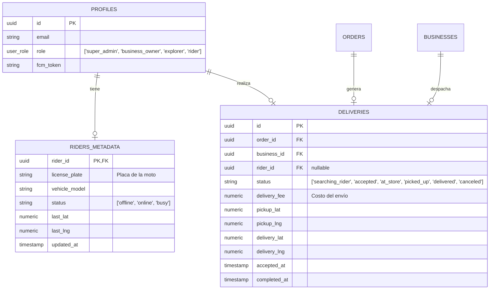

# 🏍️ SISTEMA MOTO-FOWY (MÓDULO DE REPARTIDORES EN TIEMPO REAL)
## ESPECIFICACIÓN DE INGENIERÍA Y PLAN DE ARQUITECTURA DETALLADO

Este documento contiene la planeación y arquitectura del sistema **Moto-Fowy**, un servicio de entrega a domicilio de última milla integrado nativamente en el ecosistema Fowy. El sistema está diseñado para conectar de manera ultra-rápida y en tiempo real a **Socios (Negocios)**, **Repartidores (Motos)** y **Exploradores (Clientes)** bajo los más altos estándares de calidad, resiliencia y diseño premium definidos en la [Guía de Conceptos de Fowy](file:///c:/Users/cange/Documents/fowy/Markdown/conceptos.md).

---

## 🗺️ 1. MAPA DE RUTAS Y DIRECCIONAMIENTO DE PÁGINAS (NEXT.JS APP ROUTER)

Alineado con la **Regla de la "Carpeta Maestra"** de Next.js, toda la interfaz del repartidor se mantendrá modular, desacoplada y contenida en su propio grupo de rutas protegido por autenticación y RLS.

```
src/
├── app/
│   ├── (rider)/                          <-- Grupo de Rutas Exclusivo para Repartidores
│   │   ├── repartidor/
│   │   │   ├── layout.tsx                <-- Controla la sesión del Rider y la inicialización GPS
│   │   │   ├── page.tsx                  <-- Dashboard de bienvenida, ingresos y estado activo/inactivo
│   │   │   ├── radar/
│   │   │   │   └── page.tsx              <-- El Radar de ofertas en tiempo real (Mapa interactivo)
│   │   │   ├── viaje/
│   │   │   │   └── [id]/
│   │   │   │       └── page.tsx          <-- Panel de ruta en vivo (Navegación al local y al cliente)
│   │   │   └── perfil/
│   │   │       └── page.tsx              <-- Gestión de datos personales, vehículo y billetera fowy
│   ├── (partners)/                       <-- Panel de Socios Existente
│   │   └── partner/
│   │       └── pedidos/
│   │           └── [id]/                 <-- Botón Premium: "Solicitar Moto-Fowy"
│   └── (explorer)/                       <-- Panel de Clientes Existente
│       └── pedidos/
│           └── [id]/                     <-- Vista del cliente: Seguimiento de la moto en tiempo real
│
├── components/
│   └── rider/                            <-- Componentes Desacoplados y Reutilizables (Fácil Mantenimiento)
│       ├── shared/
│       │   ├── RiderNavBar.tsx           <-- Navegación inferior con micro-interacciones haptics virtuales
│       │   └── RiderActiveStatusCard.tsx <-- Badge flotante de estado activo con brillo pulsante
│       ├── radar/
│       │   ├── OffersRadarMap.tsx        <-- Mapa de ofertas dinámicas (Carga diferida)
│       │   └── OfferPremiumCard.tsx      <-- Tarjeta con conteo regresivo animado para aceptar viaje
│       └── viaje/
│           ├── TripNavigationMap.tsx     <-- Mapa con rutas de ruteo de Leaflet/RoutingMachine
│           └── TripProgressSteps.tsx     <-- Slider interactivo tipo "Slide-to-Confirm" para cambiar de estado
```

> [!NOTE]
> Siguiendo el **Concepto 2 (Filosofía de Desacoplamiento)**, todos los mapas de la interfaz del rider (`OffersRadarMap.tsx` y `TripNavigationMap.tsx`) se cargarán usando importaciones dinámicas (`next/dynamic`) con `{ ssr: false }`, previniendo colisiones con el DOM del servidor en Next.js.

---

## 🗄️ 2. MODELADO DE DATOS UNIFICADO (SUPABASE)

La base de datos se expandirá de forma segura agregando el rol de `'rider'` al tipo enumerado existente y creando tablas relacionales protegidas mediante políticas de seguridad a nivel de fila (RLS).



### Script de SQL Recomendado (Para Migraciones Seguras en Supabase):
```sql
-- 1. Agregar el nuevo rol 'rider' a la lista de tipos de usuario
ALTER TYPE user_role ADD VALUE IF NOT EXISTS 'rider';

-- 2. Crear tabla de metadata para los repartidores
CREATE TABLE public.riders_metadata (
    rider_id UUID PRIMARY KEY REFERENCES public.profiles(id) ON DELETE CASCADE,
    license_plate TEXT NOT NULL,
    vehicle_model TEXT NOT NULL,
    status TEXT DEFAULT 'offline' CHECK (status IN ('offline', 'online', 'busy')),
    last_lat NUMERIC(10, 8),
    last_lng NUMERIC(11, 8),
    updated_at TIMESTAMPTZ DEFAULT NOW()
);

-- 3. Crear tabla para el control de viajes (Despacho)
CREATE TABLE public.deliveries (
    id UUID PRIMARY KEY DEFAULT gen_random_uuid(),
    order_id UUID REFERENCES public.orders(id) ON DELETE CASCADE,
    business_id UUID REFERENCES public.businesses(id) ON DELETE CASCADE,
    rider_id UUID REFERENCES public.profiles(id) ON DELETE SET NULL,
    status TEXT DEFAULT 'searching_rider' CHECK (status IN ('searching_rider', 'accepted', 'at_store', 'picked_up', 'delivered', 'canceled')),
    delivery_fee NUMERIC(10, 2) DEFAULT 0,
    pickup_lat NUMERIC(10, 8) NOT NULL,
    pickup_lng NUMERIC(11, 8) NOT NULL,
    delivery_lat NUMERIC(10, 8) NOT NULL,
    delivery_lng NUMERIC(11, 8) NOT NULL,
    created_at TIMESTAMPTZ DEFAULT NOW(),
    accepted_at TIMESTAMPTZ,
    completed_at TIMESTAMPTZ
);

-- 4. Habilitar Seguridad RLS
ALTER TABLE public.riders_metadata ENABLE ROW LEVEL SECURITY;
ALTER TABLE public.deliveries ENABLE ROW LEVEL SECURITY;

-- Ejemplo de Política RLS: Los repartidores solo pueden editar su propia ubicación
CREATE POLICY "Riders can update their own metadata"
    ON public.riders_metadata FOR UPDATE
    USING (auth.uid() = rider_id);
```

---

## ⚡ 3. FLUJO DE TIEMPO REAL CON CONTROL DE ESTABILIDAD (REALTIME STABILITY)

El corazón de Moto-Fowy recae en la sincronización ultra-rápida. Para garantizar que los eventos se despachen de inmediato sin colisiones en React 19 y evitando fugas de memoria, implementaremos el **Capa de Control Estabilidad Realtime (Concepto 6)**:

### Lógica del Hook Reactivo del Repartidor (`useRiderRadar.ts`)

```typescript
import { useEffect, useState, useRef } from "react";
import { createClient } from "@/utils/supabase/client";

export function useRiderRadar(riderId: string) {
  const [availableOffers, setAvailableOffers] = useState<any[]>([]);
  const supabase = createClient(); // Singleton instanciado a nivel de módulo
  
  // Patrón useRef para Stale Closures (Evitar desfases de datos en callbacks de Realtime)
  const offersRef = useRef<any[]>([]);
  offersRef.current = availableOffers;

  useEffect(() => {
    // Canal único con ID aleatorio para prevenir colisiones durante Fast Refresh
    const channelId = `rider-radar-${riderId}-${Math.random().toString(36).substr(2, 9)}`;
    const radarChannel = supabase.channel(channelId);

    radarChannel
      .on(
        "postgres_changes",
        {
          event: "INSERT",
          schema: "public",
          table: "deliveries",
          filter: "status=eq.searching_rider",
        },
        (payload) => {
          const newOffer = payload.new;
          // Agregar nueva oferta al listado si cumple con criterios de distancia
          setAvailableOffers((prev) => [newOffer, ...prev]);
          
          // Lanzar Notificación Sonora o Haptic Feedbacks
          try {
            const audio = new Audio("/sounds/new_offer_premium.mp3");
            audio.play();
          } catch (e) {
            console.log("Audio play blocked by browser.");
          }
        }
      )
      .on(
        "postgres_changes",
        {
          event: "UPDATE",
          schema: "public",
          table: "deliveries",
        },
        (payload) => {
          const updated = payload.new;
          // Si la oferta ya fue tomada por otro conductor, removerla de la lista
          if (updated.status !== "searching_rider") {
            setAvailableOffers((prev) => prev.filter((item) => item.id !== updated.id));
          }
        }
      )
      .subscribe();

    // Cleanup resiliente (Concepto 6 - Evita Memory Leaks)
    return () => {
      supabase.removeChannel(radarChannel);
    };
  }, [riderId, supabase]);

  return { availableOffers };
}
```

---

## 🛰️ 4. SEGUIMIENTO DE UBICACIÓN GPS (LIVE COORDINATES ENGINE)

El teléfono del repartidor actuará como el satélite emisor. Mediante la API de geolocalización nativa del navegador, la posición se sincroniza periódicamente con Supabase.

```javascript
// Función para iniciar el watch de alta precisión en el dispositivo del Repartidor
let watchId = null;

export function startLiveGPSTracking(riderId, supabaseClient) {
  if (!navigator.geolocation) {
    console.error("Geolocalización no soportada por el navegador");
    return;
  }

  watchId = navigator.geolocation.watchPosition(
    async (position) => {
      const { latitude, longitude, heading } = position.coords;

      // Actualización silenciosa en Supabase (Base de datos remota)
      const { error } = await supabaseClient
        .from("riders_metadata")
        .update({
          last_lat: latitude,
          last_lng: longitude,
          updated_at: new Date().toISOString()
        })
        .eq("rider_id", riderId);

      if (error) console.error("Error sincronizando GPS:", error);
    },
    (error) => {
      console.error("Error en sensor GPS:", error.message);
    },
    {
      enableHighAccuracy: true,  // Forzar uso de GPS de alta precisión (no antenas celulares)
      timeout: 10000,            // Tiempo máximo de espera del sensor (10 segundos)
      maximumAge: 0              // No usar coordenadas en caché, siempre frescas
    }
  );
}

export function stopLiveGPSTracking() {
  if (watchId !== null) {
    navigator.geolocation.clearWatch(watchId);
    watchId = null;
  }
}
```

---

## 🎨 5. INTERFAZ ULTRA-PREMIUM (ETHEREAL HIGH-TECH QUALITY)

Para enamorar tanto a repartidores como a comercios, la interfaz visual no usará estilos estándar de bootstrap o plantillas aburridas. Seguirá la identidad cromática premium de **FOWY** mediante las siguientes micro-interacciones:

1. **El "Slide-to-Confirm" (Deslizador de Estado)**: 
   * En lugar de botones ordinarios de "Llegué al local" o "Entregué el pedido", usaremos un control táctil premium desarrollado en `framer-motion` donde el conductor desliza un círculo vibrante hacia la derecha. Al completarse, ejecuta la mutación y genera un destello visual verde con una sutil vibración en dispositivos móviles (Haptic Feedback nativo).
2. **Brillo Activo Pulsante (Pulse Badge)**:
   * El indicador del estado de conexión del repartidor tendrá una animación en bucle con sombras HSL difuminadas que simulan un LED de estado físico en el celular, parpadeando suavemente de verde a esmeralda profundo si está conectado.
3. **El Radar de Ofertas**:
   * Las ofertas flotantes no aparecerán de golpe; entrarán en escena mediante un efecto de cascada suavizada con `framer-motion`, escalando desde el centro e irradiando anillos concéntricos semitransparentes en el mapa.

---

## ⚖️ 6. VEREDICTO DE INGENIERÍA: FACTIBILIDAD DE FOWY

> [!IMPORTANT]
> **VEREDICTO FINAL: TOTALMENTE VIABLE.**
> La infraestructura tecnológica actual de Fowy es **excepcional** para este proyecto. El backend modularizado en Supabase y el renderizado adaptativo de Next.js evitan por completo tener que crear un proyecto desde cero en repositorios separados. Se puede implementar de manera nativa como una extensión orgánica del core de la aplicación, garantizando máxima velocidad de carga, escalabilidad de usuarios y control absoluto de los costos de infraestructura.

---
*Plan de desarrollo unificado - FOWY 2026*
