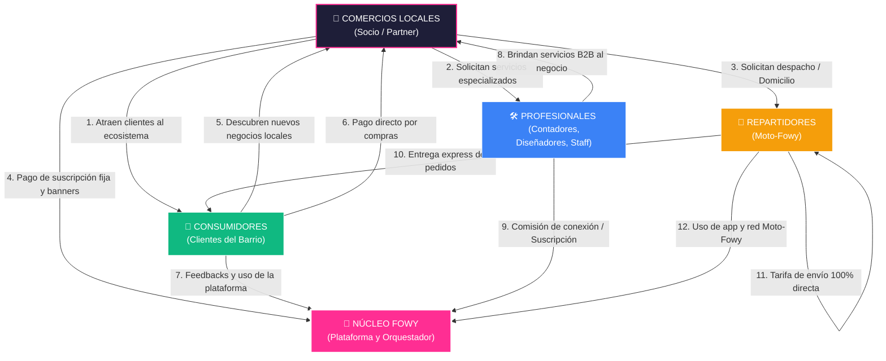

# 🌟 FOWY: El Sistema Operativo del Comercio Local y la Economía Circular

Este documento detalla la **Visión Estratégica, de Negocio e Ingeniería de FOWY**. Está diseñado para servir como guía maestra para Cristian (CEO de FOWY) y como herramienta de presentación de alto nivel para socios, inversores, comercios y profesionales.

---

## 🎯 1. LA VISIÓN: MÁS ALLÁ DE LOS DOMICILIOS

FOWY no es simplemente una aplicación de envíos ni un catálogo digital de menús. **FOWY es un Super-App de Economía Circular Local.**

El comercio de barrio y las pequeñas empresas tradicionales están muriendo bajo la presión de gigantes transnacionales que cobran comisiones abusivas. FOWY nace para **democratizar la tecnología**, entregando herramientas de software de nivel enterprise a cualquier comerciante local, creando una red orgánica donde la ganancia se redistribuye localmente en lugar de escapar a paraísos fiscales.

---

## ⚖️ 2. EL MERCADO ACTUAL: EL "SILOGISMO TECNOLÓGICO"

Las plataformas dominantes sufren de un aislamiento operativo egoísta. Solo resuelven un eslabón de la cadena de valor y asfixian al comerciante:

```
┌─────────────────────────────────────────────────────────────────────────┐
│                          EL SILOGISMO ACTUAL                            │
├───────────────────┬─────────────────────────────────────────────────────┤
│ Plataformas de    │ • Cobran comisiones brutales (hasta el 30%).        │
│ Delivery (Rappi,  │ • Secuestran la base de datos de tus clientes.      │
│ Uber, DiDi)       │ • No permiten la colaboración entre negocios.       │
├───────────────────┼─────────────────────────────────────────────────────┤
│ Creadores de Webs │ • Te dan la herramienta (el software).              │
│ (Shopify, Wix)    │ • Cero tráfico orgánico; debes buscar tus clientes. │
│                   │ • Requieren alta inversión en publicidad digital.   │
├───────────────────┼─────────────────────────────────────────────────────┤
│ Portales B2B      │ • Conectan profesionales, pero de forma global.     │
│ (LinkedIn,        │ • Desconectados de la operación física local.       │
│ Freelancer)       │ • Comisiones altas por intermediación laboral.       │
└───────────────────┴─────────────────────────────────────────────────────┘
```

### 🚀 La Revolución de FOWY
FOWY cambia las reglas del juego al unificar estas islas tecnológicas en un **Ecosistema Multi-Sided en Tiempo Real**:

1. **Descubrimiento Orgánico**: Si un usuario entra a FOWY a comprar en la *Pizzería de Juan*, el mapa interactivo y los banners locales le muestran la *Panadería de María* a la vuelta de la esquina. Un comercio atrae tráfico para todos los demás.
2. **Reducción de Costos Absoluta**: En lugar de comisiones del 30%, los comercios operan con un modelo de suscripción plano y justo.
3. **Economía Colaborativa Real**: El dinero invertido en el ecosistema circula entre vecinos: el comercio contrata profesionales del barrio, los repartidores locales entregan los pedidos, y las ganancias se reinvierten localmente.

---

## 🗺️ 3. EL MAPA DE VALOR DE FOWY

El siguiente mapa conceptual ilustra cómo fluye el valor, los datos, el empleo y los ingresos dentro de la economía circular de FOWY. Ningún actor es una isla; todos se potencian mutuamente.



### 💎 Propuestas de Valor por Actor:

* **Para los Negocios (Socio-Fowy)**:
  * Catálogo interactivo premium que vende las 24 horas del día.
  * Presencia automática en el mapa dinámico de exploración.
  * Acceso directo a una flota de reparto dedicada (**Moto-Fowy**) sin depender de monopolios de domicilios.
  * Portal de empleo y servicios para contratar profesionales locales validados (diseñadores de menús, contadores, personal de apoyo).
* **Para los Consumidores (Clientes)**:
  * Una plataforma unificada para descubrir todo lo que ofrece su vecindario.
  * Compra directa y ágil mediante WhatsApp o checkout integrado.
  * Apoyo real a la economía de su comunidad, sabiendo que su dinero beneficia directamente a los comercios y repartidores de su zona.
* **Para los Profesionales**:
  * Un marketplace de empleo y proyectos enfocado 100% en suplir las necesidades del comercio de proximidad.
  * Oportunidades de contratos rápidos y estables sin competir con tarifas globales devaluadas.
* **Para los Repartidores (Moto-Fowy)**:
  * Ingresos dignos con tarifas transparentes y asignación inteligente de rutas por geolocalización.
  * Respeto a su labor como pilar de la distribución logística local.

---

## 🏗️ 4. LA FORTALEZA DE INGENIERÍA: ARQUITECTURA INFINITAMENTE ESCALABLE

Para que un ecosistema tan robusto no colapse técnica ni financieramente con miles de usuarios concurrentes, FOWY está estructurado bajo principios de arquitectura modernos de última generación:

### A. Modularidad Extrema con Next.js (Grupos de Rutas)
En lugar de tener tres aplicaciones móviles distintas en repositorios separados (lo cual quintuplicaría los costos de mantenimiento y desarrollo), FOWY utiliza los **Grupos de Rutas de Next.js App Router**:

```
src/app/
├── (explorer)/      --> Aplicación del Consumidor (Mapa, Menú, Búsqueda)
├── (partners)/      --> Portal de Gestión de los Negocios
├── (rider)/         --> Aplicación PWA del Repartidor (Moto-Fowy)
└── (admin)/         --> Panel de Administración Centralizado de FOWY
```
* **¿Por qué no se rompe?** Cada grupo es un silo aislado. Si se despliega una actualización crítica para los repartidores en `(rider)`, el portal de exploración de los clientes no sufre caída de servicio ni riesgo de bugs cruzados. Comparten la misma base de estilos globales y componentes reutilizables, reduciendo el tamaño total del bundle.

### B. Seguridad y Datos Blindados con Supabase RLS
Una base de datos relacional robusta (PostgreSQL) optimizada mediante **Row Level Security (RLS)**:
* El sistema aplica políticas a nivel de servidor que determinan en microsegundos qué datos puede leer o escribir cada usuario según su rol (`user`, `partner`, `rider`, `admin`).
* Garantiza aislamiento absoluto de transacciones financieras y datos de clientes.

### C. Tiempo Real Serverless y Desacoplado
El sistema de asignación de ofertas y geolocalización en vivo de **Moto-Fowy** no requiere un servidor WebSocket tradicional (Node.js/Socket.io) encendido 24/7 devorando memoria RAM y aumentando la factura de servidores.
* Usamos los **Canales Dinámicos (Broadcast y Presence) de Supabase**. Los dispositivos se comunican de extremo a extremo coordinados por la base de datos sin fricción. Esto permite escalar de 10 a 10,000 repartidores en vivo sin aumentar un solo dólar en la infraestructura base del servidor de aplicaciones.

---

## 💼 5. EL MOTOR DE MONETIZACIÓN DE FOWY

FOWY no depende de una sola fuente de ingresos, lo que le da estabilidad financiera en tiempos de fluctuación de mercado:

1. **Suscripción Fija para Negocios (SaaS)**: Tarifas mensuales justas en lugar de comisiones por pedido. Los comerciantes pueden presupuestar sus gastos de forma predecible.
2. **Plataforma de Publicidad (Banners Dinámicos)**: Los comercios compran visibilidad local en los banners rotativos del buscador de clientes.
3. **Conexión de Profesionales**: Micro-comisiones por la intermediación exitosa de contratos entre comerciantes y profesionales locales.
4. **Red de Logística Moto-Fowy**: Gestión optimizada del despacho de entrega.

---

## ⚖️ 6. VEREDICTO DE INGENIERÍA

> [!IMPORTANT]
> **FOWY está totalmente preparado para ser un gigante.**
> Su código fuente actual respeta las mejores prácticas de desacoplamiento, alto rendimiento de renderizado en servidor (SSR), y manejo de estados dinámicos en cliente. El proyecto se expande orgánicamente. Cada nueva sección es un bloque modular que encaja a la perfección en la estructura existente. No hay deuda técnica acumulada, lo que garantiza velocidad máxima de desarrollo para las siguientes fases.

---
*FOWY: Tecnología Humana para el Comercio Real - 2026*
