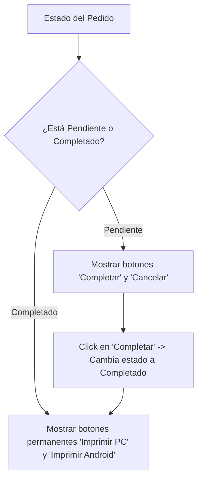

# 🖨️ ESPECIFICACIÓN TÉCNICA E IMPLEMENTACIÓN DE IMPRESIÓN

Este documento detalla el plan de implementación para la funcionalidad de impresión de tickets desde el panel de órdenes de negocio, rigiéndose por los estándares de modularidad y la **Ley del Remolque** establecidos en [conceptos.md](file:///c:/Users/cange/Documents/fowy/Markdown/conceptos.md).

---

## 📊 1. ANÁLISIS DE COMPLEJIDAD Y ENFOQUES

### Opción A: Impresión Nativa Web (CSS Print)
* **Complejidad**: 2 / 10
* **Descripción**: Usa estilos CSS `@media print` para ocultar la interfaz del panel y dejar visible únicamente la plantilla de la factura. Al presionar el botón de PC, se dispara `window.print()`.
* **Compatibilidad**: Universal (PC, macOS, Android, iOS).

### Opción B: Protocolo RawBT (Android)
* **Complejidad**: 4.5 / 10
* **Descripción**: Genera una cadena de comandos de texto plano adaptada a formato ESC/POS (ancho de 58mm o 80mm) y la envía mediante un enlace profundo de Android (`intent://`) hacia la aplicación RawBT, imprimiendo sin mostrar diálogos de confirmación del navegador.
* **Compatibilidad**: Dispositivos Android con impresoras térmicas conectadas por USB o Bluetooth.

---

## 🛠️ 2. FLUJO DE USUARIO EN PANTALLA

Según la nueva especificación de UX (enfocada en no estorbar a los usuarios que no imprimen), el comportamiento en la lista de pedidos será:

1. **Si el pedido está Pendiente:** Se muestran los botones normales de "Completar" y "Cancelar". Al darle "Completar", la orden simplemente pasa a completada sin popups ni confirmaciones extras (ideal para quien no usa impresora).
2. **Si el pedido está Completado:** En el espacio vacío de acciones, se muestran **permanentemente** los dos botones de impresión:
   * **Imprimir PC / Web** 💻
   * **Imprimir Android / RawBT** 📱
3. Esto permite a los negocios imprimir en el momento o re-imprimir pedidos viejos cuando lo deseen, respetando perfectamente a los distintos perfiles de usuario.

---

## 📝 3. CHECKLIST DETALLADO DE IMPLEMENTACIÓN

Siguiente el principio de modularidad y desacoplamiento absoluto de componentes:

### 🗄️ Fase 0: Adecuación de Datos (Pre-requisito Crítico)
- [x] **0.1. Modificar Tabla `orders` en Supabase**
  - Añadir columnas opcionales (nullable) para almacenar los datos de envío y pago que actualmente solo se envían por WhatsApp: `delivery_address` (text), `notes` (text), `payment_method` (text), y `cash_change` (text). No alterar los datos existentes.
- [x] **0.2. Actualizar `useCheckoutLogic.ts`**
  - Modificar la función de guardado en Supabase para insertar estos nuevos campos en la tabla `orders` y asegurar que la información esté disponible para el panel de negocio al imprimir.

### 📦 Fase 1: Creación de Módulos Independientes (Código Nuevo - Desde Cero)
- [ ] **1.1. Diseñar el Componente del Ticket (`OrderTicket.tsx`)**
  - Crear un nuevo componente en `src/components/partners/orders/OrderTicket.tsx`.
  - **Tipado Estricto:** Definir una interfaz en TypeScript (`OrderTicketData`) para los props del componente. Esta interfaz debe extender `Order` de `useOrderManager` y declarar opcionalmente los campos nuevos (`delivery_address`, `notes`, `payment_method`, `cash_change`) para evitar errores de compilación sin alterar el código de tipos viejos de Supabase. Evitar el uso de `any` para los ítems y tipar los nuevos campos de dirección/pago, cumpliendo la regla 7.1.
  - **ESTRUCTURA DETALLADA DE LA COMANDA (Plantilla Predeterminada):**
    - **A. Encabezado (Header Dinámico):** Extraer e imprimir únicamente el Nombre del Negocio y el Teléfono de contacto (Se omite dirección del negocio ya que no existe en base de datos).
    - **B. Datos del Cliente y Envío:** Imprimir Nombre, Celular y Dirección de Entrega. *(NOTA: La Ubicación GPS o URL no va en la estructura de la comanda)*.
    - **C. Cuerpo (Ítems y Notas):** Mapear el listado de `items` (cantidades, descripción, subtotales). **Crucial:** Renderizar de forma visible cualquier nota de preparación (ej: "sin salsas") debajo de cada producto.
    - **D. Totales y Pago (Devuelta):** Mostrar Subtotal y Total a Pagar. Mostrar el Método de Pago. **Crucial:** Si es "Efectivo", mostrar el monto "Paga con: $X" y calcular/mostrar la "Devuelta: $Y".
    - **E. Pie de Página (Footer dinámico):** Imprimir mensaje de agradecimiento y el enlace al menú web usando el `slug` del negocio:
      ¡Gracias por tu compra!           
            Visita nuestro menú
      https://www.fowy.pro/[slug_del_negocio]
  - Aplicar estilos CSS específicos de ancho fijo (ej. `w-[80mm]` o `w-[58mm]`) y clases específicas para ocultarlo en la vista normal de pantalla, mostrándolo únicamente en el flujo de impresión.
- [ ] **1.2. Desarrollar el Hook de Impresión (`useOrderPrinter.ts`)**
  - Crear un hook modular en `src/hooks/useOrderPrinter.ts`.
  - Implementar la función de formateo de texto plano ESC/POS para la opción RawBT (Opción B).
  - Implementar el disparador `window.print()` configurando el título del documento dinámicamente con el ID de la orden.
  - Implementar la lógica para disparar el Intent de Android hacia RawBT: `intent://...#Intent;scheme=rawbt;package=ru.a402d.rawbtprinter;end;`.

### 🔗 Fase 2: Integración en la Interfaz (Código Heredado - Ley del Remolque)
- [ ] **2.1. Adaptar la Fila de Pedidos (Componente Orquestador)**
  - Para evitar que `page.tsx` supere las 250 líneas (Regla de la Carpeta Maestra), abstraer la lógica de renderizado de botones creando un nuevo componente `OrderActionButtons.tsx` en `src/components/partners/orders/`.
  - Este componente recibirá el `status` de la orden y decidirá qué botones renderizar (Pendiente = Completar/Cancelar | Completado = Botones de Impresión).
  - **Ampliación de Consulta:** Modificar la consulta de Supabase en `page.tsx` para seleccionar no solo `id, rating`, sino también `name, phone, slug` del negocio, permitiendo pasar esta data (necesaria para el header y footer) a la comanda.
- [ ] **2.2. Implementar los Botones de Acción (Flujo Optimizado)**
  - Reemplazar la lógica actual de botones en `page.tsx` por el nuevo componente `OrderActionButtons.tsx`.
  - **Botones de Estado Pendiente**: Mantiene el comportamiento actual (Completar/Cancelar).
  - **Botones de Estado Completado**: Renderiza los botones de **Imprimir PC** e **Imprimir Android**. Llama a `useOrderPrinter` sin alterar el estado de la orden (ya está completada).
  - **Micro-animaciones:** Usar `AnimatePresence` de `framer-motion` para que la transición (cuando la orden pasa de Pendiente a Completada) revele los botones de impresión con una transición suave.
  - En caso de error al invocar la impresión, usar Toasts Premium (nunca `alert()`).
- [ ] **2.3. Insertar el Componente Oculto en el DOM**
  - Renderizar el componente `<OrderTicket />` dentro del mapa de pedidos de forma oculta para que el navegador lo detecte al invocar la cola de impresión.
